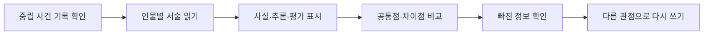

# Perspective Lens Case Room

> 한국어 서비스명: **관점 렌즈 사건실**  
> 문서 상태: 설계 확정 전 검토본 · 구현하지 않음  
> 작성일: 2026-08-26

## 1. 프로젝트 개요

| 항목 | 설계 내용 |
|---|---|
| 대상 | 초등 5~6학년 |
| 교과 | 국어 |
| 핵심 질문 | 같은 사건도 말하는 사람의 위치와 관심에 따라 어떻게 다르게 표현될까요? |
| 한 차시 권장 시간 | 30~40분 |
| 실행 형태 | 독창적 가상 이야기 기반 정적 웹앱 |
| 핵심 산출물 | 사실·추론·평가 분류표, 관점 비교표, 관점 전환 문장 |

학생은 하나의 사건을 서로 다른 인물이 서술한 짧은 글로 읽습니다. 각 서술에서 직접 확인되는 사실, 인물의 추론, 평가가 담긴 표현을 구분하고, 어느 한 서술자를 거짓말쟁이로 만들지 않은 채 관점의 차이를 설명합니다.

## 2. 설계 원칙

- 관점의 차이를 참·거짓의 단순 대립으로 처리하지 않습니다.
- 인물이 보지 못한 정보, 중요하게 여긴 목표, 사용한 평가 표현을 구분합니다.
- 복수의 해석이 본문 근거로 뒷받침되면 모두 타당한 답으로 인정합니다.
- 실제 학생 갈등, 따돌림, 가정 상황을 소재로 삼지 않고 정서적으로 안전한 가상 사건을 사용합니다.
- 자유 글 전체를 AI로 채점하지 않고, 근거 선택과 구조화된 문장 틀을 중심으로 피드백합니다.

## 3. 교육과정 연계와 학습 목표

- `[6국02-04]`: 글에 나타난 관점이나 내용의 차이를 비교하며 읽고 문제 해결에 활용하기
- `[6국02-02]`: 글의 맥락과 표현을 바탕으로 생략되거나 드러나지 않은 내용을 추론하기

| 수준 | 학습 목표 |
|---|---|
| 이해 | 관점이 사건을 바라보는 위치·관심·목적과 관련됨을 설명합니다. |
| 적용 | 문장을 관찰 사실, 추론, 평가 표현으로 구분합니다. |
| 분석 | 두 서술의 공통 사실과 서로 다른 해석을 비교합니다. |
| 창안 | 같은 사실을 다른 인물의 관점에서 다시 표현합니다. |

## 4. 기존 앱과의 차별성

| 비교 대상 | 기존 앱의 중심 | 이 앱의 고유 중심 |
|---|---|---|
| 팩트체크 편집국 | 외부 자료로 주장의 사실성 판단 | 같은 사건 안에서 서술 위치와 관심 비교 |
| 이야기 마음 근거 수사대 | 행동·표정·대사로 인물 마음 추론 | 서술자가 선택한 정보와 평가 표현 분석 |
| 이미지 의미 편집실 | 자르기·배치·색이 이미지 의미에 미치는 영향 | 언어로 구성된 복수 관점의 비교 |

## 5. 핵심 학습 흐름

중립 사건 기록은 처음부터 전부 공개하지 않습니다. 먼저 두 서술을 읽고 판단한 뒤, 관찰 가능한 일부 기록을 열어 자신의 해석을 수정하게 합니다.

## 6. 사건 팩 설계

| 사건 | 서술자 | 관점 차이의 초점 |
|---|---|---|
| 운동장 정리 상자 | 정리 담당, 놀이를 마친 학생 | 속도와 꼼꼼함 중 무엇을 중요하게 보았는가 |
| 사라진 우산 표찰 | 우산 주인, 안내 담당 | 본 정보와 추측한 정보의 차이 |
| 동아리 알림 포스터 | 만든 학생, 처음 본 학생 | 익숙한 정보와 독자에게 필요한 정보의 차이 |
| 도서관 창가 자리 | 읽던 학생, 창문을 닫은 학생 | 편안함과 책 보존이라는 서로 다른 관심 |

모든 이야기는 직접 작성한 짧은 원문을 사용하고, 정답 근거가 특정 문장에 명확히 연결되도록 사전 검수합니다.

## 7. 화면 및 정보 구조

| 화면 | 주요 요소 | 학생 행동 |
|---|---|---|
| 사건 접수 | 사건 그림, 시간 순서, 핵심 질문 | 첫 예상 선택 |
| 렌즈 A/B | 인물별 서술, 문장 번호 | 중요 문장 표시 |
| 근거 보드 | 사실·추론·평가 세 영역 | 문장 선택 후 영역 지정 |
| 교차 조사 | 공통 사실, 서로 다른 표현, 빠진 정보 | 비교 관계 연결 |
| 관점 전환 | 인물·독자·목적 카드, 문장 블록 | 다른 관점으로 재구성 |
| 사건 보고서 | 최초 판단·수정·근거 | 설명 확인 및 다시 읽기 |

문장을 끌어 놓는 대신 `문장 선택 → 분류 버튼`으로도 같은 활동을 할 수 있게 합니다.

## 8. 콘텐츠·판정 모델

- 각 문장은 `관찰 사실`, `인물의 추론`, `평가가 담긴 표현`, `혼합 문장` 메타데이터를 가집니다.
- 혼합 문장은 한 범주만 강요하지 않고 어느 부분이 사실이고 어느 부분이 평가인지 나눠 보게 합니다.
- 관점 전환 문장은 필수 사실, 허용 가능한 관점 표현, 모순되는 표현을 구조화된 규칙으로 검사합니다.
- 자유 입력은 임시 메모로 제공할 수 있으나 자동 정오 판정이나 서버 전송을 하지 않습니다.
- “관점이 다르다”가 “아무 말이나 맞다”는 뜻이 아님을 근거 일치 여부로 보여 줍니다.

## 9. 피드백과 평가

| 평가 요소 | 3단계 | 2단계 | 1단계 |
|---|---|---|---|
| 근거 구분 | 사실·추론·평가를 문장 부분까지 구분 | 문장 단위로 대체로 구분 | 느낌으로만 판단 |
| 관점 비교 | 위치·관심·빠진 정보를 함께 설명 | 차이 한 가지를 설명 | 한 인물의 옳고 그름만 판단 |
| 다시 쓰기 | 사실을 유지하며 관점 표현을 바꿈 | 일부 사실이 빠지지만 관점은 드러남 | 원문을 거의 그대로 복사 |

피드백은 타당한 복수 답을 허용하고, 반드시 해당 문장 번호와 연결합니다. 결과는 총점보다 `사용한 근거`, `수정한 판단`, `남은 질문`을 먼저 제시합니다.

## 10. UI·접근성 설계

- 본문 글자 크기와 줄 간격을 조절할 수 있고 읽기 폭을 제한합니다.
- 인물은 색뿐 아니라 이름·아이콘·테두리 모양으로 구분합니다.
- 현재 필수 행동인 `근거 표시하기`, `비교 완료` 버튼에만 `gi-pulse`를 순차 적용합니다.
- 모션 감소 설정에서는 애니메이션 없이 고정 강조와 단계 설명을 사용합니다.
- 스크린 리더가 문장 번호, 분류, 선택 상태를 읽을 수 있게 구조화합니다.
- 한 화면에 두 글을 나란히 읽기 어려운 모바일에서는 탭 전환과 `차이 요약`을 제공합니다.

## 11. 기술 구조 설계

- Vite + React + TypeScript 기반 정적 SPA를 권장합니다.
- 이야기 원문, 문장 단위 근거, 허용 답, 피드백을 콘텐츠 파일로 분리합니다.
- 서술 비교 상태와 최초·수정 선택을 별도 저장하여 학습 변화를 재현합니다.
- 서버, 로그인, 외부 AI API, 원격 분석 도구를 사용하지 않습니다.
- 자유 메모는 기본적으로 탭을 닫으면 사라지며, 저장을 명시적으로 선택한 경우에만 로컬에 남깁니다.

## 12. 개인정보·정서 안전

- 학생 본인의 갈등이나 감정을 입력하도록 요구하지 않습니다.
- 학교폭력, 범죄, 가족 갈등처럼 전문적 개입이 필요한 상황을 미션으로 쓰지 않습니다.
- 특정 인물의 성격을 고정적으로 낙인찍는 표현을 정답으로 제공하지 않습니다.
- 모든 사건과 인물은 가상이며 실제 인물 평가에 쓰는 도구가 아님을 알립니다.

## 13. MVP 범위

### 포함

- 독창적 사건 4개, 사건별 두 관점
- 문장 근거 분류, 공통점·차이점 비교
- 블록 기반 관점 전환과 복수 타당 답
- 교사용 활동 요약과 인쇄 보기

### 제외

- 실제 뉴스·학생 글 업로드
- 자유 글 AI 채점 또는 감정 분석
- 토론 게시판과 학생 간 평가
- 장편 이야기 제작 도구

## 14. 완료 기준

- 모든 정답·복수 답이 원문의 문장 근거와 연결되어 있습니다.
- 한 관점을 거짓으로 몰지 않고 사실·추론·평가를 분리합니다.
- 학생이 최초 판단과 수정 판단을 결과 화면에서 비교할 수 있습니다.
- 드래그 없이, 키보드만으로 전체 활동을 완료할 수 있습니다.
- 375px 모바일, 200% 확대, 스크린 리더 구조, 모션 감소를 검증합니다.
- 결과 화면은 총점 대신 근거의 질과 관점 전환 과정을 중심으로 보여 줍니다.

## 15. 업데이트 내역 버튼 설계

화면 오른쪽 아래의 작은 `업데이트 내역` 버튼에 사건 자료 검수일과 표현 수정 내역을 남깁니다.

| 날짜 | 구분 | 내역 |
|---|---|---|
| 2026-08-26 | 설계 | 최초 설계 문서 작성 |
| 구현일 입력 예정 | 개발 | MVP 구현과 이야기 검수 완료 시 실제 날짜 기록 |

## 16. 이번 문서의 경계

이 문서는 학습 경험과 콘텐츠 검수 원칙만 정의합니다. 이야기 원문 집필 완료, UI 구현, 코드, 테스트, 배포, 아카이브 등록은 이번 작업에 포함하지 않습니다.
