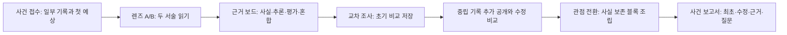

# Perspective Lens Case Room Implementation Plan

> **For agentic workers:** REQUIRED SUB-SKILL: Use superpowers:subagent-driven-development (recommended) or superpowers:executing-plans to implement this plan task-by-task. Steps use checkbox (`- [ ]`) syntax for tracking.

**Goal:** 초등 5~6학년 학생이 하나의 가상 사건을 두 관점으로 읽고 관찰 사실·추론·평가를 근거 문장과 연결해 구분한 뒤, 공통 사실과 빠진 정보를 비교하고 사실을 보존한 관점 전환 문장을 완성하는 정적 웹앱 MVP를 구축합니다.

**Architecture:** Vite 정적 SPA 안에서 콘텐츠 데이터, 순수 판정 함수, 학습 세션 상태, 화면 기능을 분리합니다. 네 사건 팩은 런타임 스키마 검증을 거쳐 로드하고, `useReducer` 기반 단계 상태기가 최초 판단과 수정 판단을 별도 보존하며, 모든 판정은 서버나 AI 없이 근거 ID 집합을 비교하는 결정론적 함수로 수행합니다. UI는 드래그 없이 선택과 버튼만으로 완주할 수 있고 세션 진행은 `sessionStorage`, 명시적으로 저장한 자유 메모와 읽기 설정만 `localStorage`에 저장합니다.

**Tech Stack:** Vite, React, TypeScript strict mode, CSS, Vitest, Testing Library, Playwright, `@axe-core/playwright`, ESLint, npm

---

## Plan Status and Execution Boundary

- 기준 프로젝트 루트는 `/Volumes/ External Drive 256G/Dev2/codex/perspective-lens-case-room`입니다.
- 계획 작성 시점의 루트에는 설계 문서만 있고 Git 저장소, 패키지, 소스, 설정, 테스트가 없습니다.
- 이 문서는 구현 순서와 검증 계약만 정의합니다. 아래 셸 명령과 커밋 명령은 구현 승인을 받은 실행 담당자가 각 체크박스를 수행할 때만 실행합니다.
- 현재 계획 작성 작업에서는 이 계획 문서 외의 파일 생성·수정, 패키지 설치, Git 초기화, 커밋, 푸시, 배포를 수행하지 않습니다.
- 구현 완료와 배포 완료는 별도 상태입니다. 이 계획의 종료점은 로컬 MVP 품질 게이트 통과와 로컬 커밋이며, 원격 저장소 생성·푸시·GitHub Pages 배포·아카이브 등록은 포함하지 않습니다.

## Spec

### 1. Learning Contract

| 학습 수준 | 학생 행동 | 구현 계약 | 검증 위치 |
|---|---|---|---|
| 이해 | 관점이 위치·관심·목적과 관련됨을 설명 | 사건 접수의 핵심 질문, 렌즈 카드의 `위치/관심/목적`, 보고서의 관점 설명 | Tasks 11, 15, 18 |
| 적용 | 문장을 관찰 사실·추론·평가·혼합으로 구분 | 문장 선택 후 분류 버튼, 혼합 문장의 부분 선택, 문장 번호 기반 피드백 | Tasks 2, 7, 12 |
| 분석 | 두 서술의 공통 사실·다른 해석·빠진 정보를 비교 | 초기 비교를 저장한 뒤 중립 기록 공개, 수정 비교를 별도 저장 | Tasks 8, 10, 13, 15, 18 |
| 창안 | 같은 사실을 다른 관점에서 다시 표현 | 인물·독자·목적 카드와 사실/관점 표현 블록 조립, 모순 검사 | Tasks 9, 14, 15, 18 |

교육과정 `[6국02-04]`는 비교·수정·보고 단계로, `[6국02-02]`는 추론 분류·빠진 정보·중립 기록 공개 단계로 직접 연결합니다. 결과 화면은 점수보다 `사용한 근거`, `수정한 판단`, `남은 질문`을 먼저 보여 줍니다.

### 2. Differentiation Contract

- 외부 자료의 진위를 확인하는 팩트체크 앱이 아닙니다. 파일 업로드, 검색, 외부 URL 입력, 참/거짓 투표를 만들지 않습니다.
- 표정이나 행동만으로 마음을 맞히는 앱이 아닙니다. 모든 피드백은 서술 문장 번호, 본 정보, 중요하게 여긴 목표, 평가 표현 중 하나 이상을 가리킵니다.
- 이미지 편집 앱이 아닙니다. 그림은 사건 맥락을 돕는 장식·설명 자산이며 핵심 조작은 언어 근거 비교입니다.
- 어느 서술자도 거짓말쟁이로 판정하지 않습니다. 판정 타입에 `liar`, `truthScore`, `winner` 같은 필드를 두지 않고 `supported`, `partially-supported`, `revise`만 사용합니다.
- 복수 해석은 원문 근거 ID와 연결된 경우에만 인정합니다. “관점이 다르면 아무 말이나 맞다”는 메시지를 사용하지 않습니다.

### 3. Learner Flow and Gates



`StageId`는 `intake | lenses | evidence | comparison | rewrite | report` 여섯 값만 사용합니다. `comparison` 내부의 `ComparisonPhase`는 `initial | reveal | revised`로 나누어 화면 수를 늘리지 않으면서 공개 전후 판단을 분리합니다.

| 단계 | 진입 시 보이는 정보 | 필수 완료 조건 | 다음 단계에서 보존할 상태 |
|---|---|---|---|
| 사건 접수 | 사건 그림, 한 개의 공개 기록, 핵심 질문 | `InitialHypothesis` 한 개 선택 | `initialHypothesis` |
| 렌즈 A/B | 인물 이름·아이콘·테두리, 5문장씩 | 두 렌즈 모두 읽음 표시하고 렌즈마다 중요 문장 1개 이상 표시 | `readNarratorIds`, `markedSentenceIds` |
| 근거 보드 | 선택 문장과 사실·추론·평가 세 분류 버튼 | 두 렌즈의 필수 문장 10개 분류 | `evidenceSelections` |
| 교차 조사/초기 | 공통 사실·다른 표현·빠진 정보 후보 | 공통 사실 1개 이상, 차이 1쌍 이상, 빠진 정보 1개 이상 | `initialComparison` |
| 교차 조사/공개·수정 | 추가 중립 기록과 기존 선택 | 변경 또는 유지 이유를 근거 문장과 함께 선택 | `revealedRecordIds`, `revisedComparison` |
| 관점 전환 | 인물·독자·목적 카드, 문장 블록, 임시 메모 | 필수 사실을 모두 포함하고 모순 블록을 제거 | `rewriteDraft` |
| 사건 보고서 | 최초·수정 비교, 근거 품질, 남은 질문 | 완료 표시와 다시 읽기 제공 | 세션 종료 전까지 전체 `CaseSession` |

`RewriteFeedback`은 저장 상태가 아니라 `evaluateRewrite(pack, rewriteDraft)`의 파생값입니다. 관점 전환 화면, 보고서, `getStageGate`는 같은 함수를 호출하며, 세션 직렬화에는 초안 블록 ID만 포함합니다. 새로고침 뒤에도 동일 콘텐츠와 초안으로 동일 피드백이 재계산되어야 합니다.

### 4. Content and Judgment Model

```ts
// src/model/case.ts
export type CaseId =
  | 'playground-storage-box'
  | 'missing-umbrella-tag'
  | 'club-notice-poster'
  | 'library-window-seat';

export type EvidenceCategory =
  | 'observation'
  | 'inference'
  | 'evaluation';

export type SentenceKind = EvidenceCategory | 'mixed';

export type InitialHypothesis =
  | 'seen-information'
  | 'priority'
  | 'evaluative-language';

export interface SentenceSegment {
  id: string;
  text: string;
  category: EvidenceCategory;
}

export interface NarrativeSentence {
  id: string;
  number: number;
  text: string;
  kind: SentenceKind;
  segments: readonly SentenceSegment[];
  acceptedCategorySets: readonly (readonly EvidenceCategory[])[];
  feedback: Readonly<Record<'supported' | 'partially-supported' | 'revise', string>>;
}

export interface NarratorLens {
  id: string;
  displayName: string;
  roleLabel: string;
  icon: 'clipboard' | 'ball' | 'umbrella' | 'info' | 'poster' | 'reader' | 'window' | 'book';
  borderStyle: 'solid' | 'double';
  position: string;
  interest: string;
  purpose: string;
  sentences: readonly NarrativeSentence[];
}

export interface NeutralRecord {
  id: string;
  sequence: number;
  text: string;
  visibility: 'intake' | 'reveal';
  factIds: readonly string[];
}

export interface ComparisonOption {
  id: string;
  label: string;
  evidenceSentenceIds: readonly string[];
  validFor: readonly ('shared-fact' | 'different-expression' | 'missing-information')[];
}

export interface RewriteBlock {
  id: string;
  text: string;
  factIds: readonly string[];
  perspectiveTags: readonly string[];
}

export interface RewriteRuleSet {
  targetNarratorId: string;
  audienceId: 'classmate' | 'new-reader' | 'teacher';
  purposeId: 'report' | 'guide' | 'reflection';
  requiredFactGroups: readonly (readonly string[])[];
  allowedPerspectiveTags: readonly string[];
  contradictoryBlockIds: readonly string[];
  acceptedExampleBlockSets: readonly (readonly string[])[];
}

export interface CasePack {
  id: CaseId;
  title: string;
  focusQuestion: string;
  focalContrast: 'priority' | 'seen-vs-inferred' | 'familiar-vs-new-reader' | 'comfort-vs-preservation';
  illustrationKey: CaseId;
  safetyNote: string;
  originalFiction: true;
  reviewedOn: `${number}-${number}-${number}`;
  contentReviewNote: string;
  expressionRevisionNote: string;
  neutralRecords: readonly NeutralRecord[];
  narrators: readonly [NarratorLens, NarratorLens];
  comparisonOptions: readonly ComparisonOption[];
  rewriteBlocks: readonly RewriteBlock[];
  rewriteRules: readonly [RewriteRuleSet, RewriteRuleSet];
}
```

`segments.map(segment => segment.text).join('')`는 항상 `NarrativeSentence.text`와 같아야 합니다. `kind: 'mixed'`는 학생용 네 번째 분류가 아닙니다. 학생은 사실·추론·평가 세 버튼 중 해당 범주를 복수 선택하고 각 문장 부분 ID를 연결해야 완전한 근거로 인정됩니다.

```ts
// src/model/feedback.ts
export type FeedbackStatus = 'supported' | 'partially-supported' | 'revise';

export interface EvidenceFeedback {
  status: FeedbackStatus;
  sentenceId: string;
  sentenceNumber: number;
  matchedCategoryIds: readonly EvidenceCategory[];
  missingSegmentIds: readonly string[];
  message: string;
}

export interface ComparisonFeedback {
  status: FeedbackStatus;
  supportingSentenceIds: readonly string[];
  sharedFactOptionIds: readonly string[];
  differentExpressionOptionIds: readonly string[];
  missingInformationOptionIds: readonly string[];
  message: string;
}

export interface RewriteFeedback {
  status: FeedbackStatus;
  preservedFactIds: readonly string[];
  missingFactGroupIndexes: readonly number[];
  contradictoryBlockIds: readonly string[];
  matchedPerspectiveTags: readonly string[];
  message: string;
}
```

### 5. Four Original Case Packs

각 사건은 가상 인물 두 명, 서술 5문장씩, 공개 기록 1개, 후반 공개 기록 3개 이상을 가집니다. 각 사건 전체에는 관찰·추론·평가·혼합 문장이 모두 있고, 두 개 이상의 근거 기반 비교 답과 두 개 이상의 유효한 블록 조합이 있습니다.

#### Case A: `playground-storage-box` — 운동장 정리 상자

- 가상 서술자: 정리 담당 `해솔`(`cleanup-lead`), 놀이를 마친 학생 `온유`(`last-player`).
- 중립 사실: 15:20 정리 종이 울림, 온유가 공 두 개와 운동장 끝의 공 하나를 가져옴, 해솔이 젖은 줄넘이를 옆 바구니로 분리하고 표찰을 확인함, 15:27 상자 뚜껑이 닫힘.
- 렌즈 A 문장: `정리 종이 울린 뒤 온유가 공 두 개를 상자 쪽으로 가져왔다.` / `나는 젖은 줄넘이가 다른 물건을 적실까 봐 옆 바구니에 따로 넣었다.` / `온유는 마지막 공을 가지러 다시 운동장 끝으로 갔다.` / `정리 표를 확인하지 않고 서두르면 상자가 다시 흐트러질 것 같았다.` / `그래서 오늘 정리는 빠르기보다 꼼꼼함이 더 중요했다.`
- 렌즈 B 문장: `정리 종이 울리자 나는 공 두 개를 들고 상자로 갔다.` / `해솔은 상자 앞에서 줄넘이를 한참 들여다보고 있었다.` / `나는 운동장 끝에 남은 공 하나를 가지러 뛰어갔다.` / `해솔이 빨리 넣지 못해서 정리가 늦어지는 줄 알았다.` / `그때는 먼저 모두 상자에 넣는 것이 더 효율적이라고 생각했다.`
- 판정 초점: 두 서술은 정리 행동이라는 공통 사실을 공유하지만 해솔은 꼼꼼함, 온유는 속도를 중요하게 봅니다. `한참`, `더 효율적`, `더 중요했다`는 평가 맥락을 분리합니다.
- 빠진 정보: 온유는 줄넘이를 분리한 이유를 처음에는 보지 못했고, 해솔은 온유가 먼 공까지 가져온 수고를 중심 정보로 삼지 않았습니다.
- 다시 쓰기 불변 사실: 정리 종이 울렸고, 물건을 상자로 옮겼으며, 젖은 줄넘이는 분리되었습니다.
- 검수 기록: `contentReviewNote`는 `중립 기록과 10개 문장의 사실·추론·평가 연결 검수`, `expressionRevisionNote`는 `빠르기와 꼼꼼함을 우열이 아닌 관심 차이로 표현 수정`입니다.

#### Case B: `missing-umbrella-tag` — 사라진 우산 표찰

- 가상 서술자: 우산 주인 `가람`(`umbrella-owner`), 안내 담당 `다온`(`information-helper`).
- 중립 사실: 가람이 노란 우산을 미술실 복도 걸이에 둠, 파란 표찰이 떨어져 걸이 아래로 들어감, 다온이 이름표 없는 우산을 분실물 기록에 적고 안내 책상으로 옮김, 가람이 13:15 빈 걸이를 확인함.
- 렌즈 A 문장: `미술실에서 나오며 노란 우산을 복도 걸이에 걸었다.` / `돌아왔을 때 내가 걸어 둔 자리는 비어 있었다.` / `조금 전 안내 담당 다온이 우산 걸이 앞에 서 있었다.` / `다온이 내 우산인 줄 모르고 다른 곳으로 옮겼을지도 모른다고 생각했다.` / `내 눈에는 우산이 갑자기 사라진 것처럼 보였다.`
- 렌즈 B 문장: `복도 우산 걸이에 이름표가 없는 노란 우산 한 개가 남아 있었다.` / `수업이 끝난 뒤에도 주인이 바로 찾으러 오지 않았다.` / `통로에 두면 누군가 부딪힐 수 있다고 생각했다.` / `나는 분실물 기록에 적고 안내 책상으로 옮겼다.` / `이름표가 없어서 주인을 바로 알기 어려운 우산이었다.`
- 판정 초점: 가람이 본 것은 빈 자리와 다온의 위치이고, 우산을 옮겼다는 것은 처음에는 추론입니다. 다온이 본 것은 표찰 없는 우산이며 소유자를 모른다는 판단은 당시 정보에 근거합니다.
- 빠진 정보: 가람은 표찰이 떨어진 것을 보지 못했고, 다온은 가람이 바로 돌아올 계획을 알지 못했습니다.
- 다시 쓰기 불변 사실: 우산은 복도 걸이에서 안내 책상으로 이동했고, 표찰은 걸이 아래에 떨어져 있었습니다.
- 검수 기록: `contentReviewNote`는 `표찰 공개 순서와 본 정보·추론의 문장 근거 검수`, `expressionRevisionNote`는 `우산 이동을 잘못이나 절도가 아닌 정보 차이로 표현 수정`입니다.

#### Case C: `club-notice-poster` — 동아리 알림 포스터

- 가상 서술자: 포스터를 만든 학생 `나래`(`poster-maker`), 처음 본 학생 `보람`(`first-reader`).
- 중립 사실: 월요일에 별빛 동아리 포스터가 붙음, 포스터에는 `이번 주 금요일 방과 후`와 망원경 그림이 있음, 정확한 날짜와 과학실이라는 장소는 없음, 기존 동아리원은 늘 과학실에서 모임.
- 렌즈 A 문장: `나는 별빛 동아리 모임을 알리려고 월요일에 포스터를 붙였다.` / `포스터에는 이번 주 금요일 방과 후라고 썼다.` / `망원경 그림을 크게 넣어 동아리 이름이 잘 보인다고 생각했다.` / `늘 과학실에서 모였으니 장소는 모두 알 것이라고 여겼다.` / `색이 선명해서 필요한 정보가 충분한 포스터라고 보았다.`
- 렌즈 B 문장: `월요일 점심시간에 복도에서 그 포스터를 처음 봤다.` / `포스터에는 금요일 방과 후라는 말과 망원경 그림이 있었다.` / `정확한 날짜와 모이는 교실은 적혀 있지 않았다.` / `망원경 그림만으로는 어느 동아리인지 바로 알기 어렵다고 생각했다.` / `처음 보는 사람에게는 설명이 조금 더 필요한 포스터였다.`
- 판정 초점: 나래에게 익숙한 정보와 처음 보는 독자에게 필요한 정보를 구분합니다. 선명한 색과 큰 그림은 존재 사실이지만 `충분하다`, `알기 어렵다`는 독자 관점의 평가입니다.
- 빠진 정보: 나래는 처음 보는 독자가 장소 관습을 모른다는 점을 고려하지 않았고, 보람은 기존 동아리원에게 과학실이 익숙하다는 배경을 알지 못했습니다.
- 다시 쓰기 불변 사실: 모임은 해당 주 금요일 방과 후이며, 기존 장소는 과학실이지만 새 독자에게는 날짜와 장소를 명시해야 합니다.
- 검수 기록: `contentReviewNote`는 `포스터의 표시 정보와 독자 배경 정보 연결 검수`, `expressionRevisionNote`는 `정보 부족을 만든 학생의 능력 비난이 아닌 독자 관점 차이로 표현 수정`입니다.

#### Case D: `library-window-seat` — 도서관 창가 자리

- 가상 서술자: 읽던 학생 `서윤`(`window-reader`), 창문을 닫은 학생 `하준`(`window-closer`).
- 중립 사실: 14:00 창문이 열려 있음, 14:04 바람에 전시 책장이 들림, 창문 옆에 비 오는 날 책 보호 안내가 있음, 14:05 하준이 창문을 닫고 이어서 이유를 설명함.
- 렌즈 A 문장: `나는 창가 자리에서 책을 읽고 있었고 창문은 열려 있었다.` / `바람이 들어와서 답답하지 않고 편안했다.` / `하준이 먼저 창문을 닫았다.` / `책장이 조금 흔들렸지만 책이 상할 정도는 아니라고 생각했다.` / `내게는 읽기 편한 공기를 유지하는 일이 더 중요했다.`
- 렌즈 B 문장: `창가 전시대의 책장이 바람에 여러 번 들렸다.` / `창문 옆에는 비 오는 날 책을 보호하려면 창문을 닫으라는 안내가 있었다.` / `빗방울이 들어오면 책이 젖을 수 있다고 판단했다.` / `나는 창문을 닫은 뒤 서윤에게 이유를 설명했다.` / `그때는 시원함보다 책을 보호하는 일이 더 급하다고 보았다.`
- 판정 초점: 서윤의 편안함과 하준의 책 보존 관심을 비교합니다. `상할 정도는 아니다`와 `젖을 수 있다`는 서로 다른 정보 범위에서 나온 추론으로 처리합니다.
- 빠진 정보: 서윤은 닫기 전 책 보호 안내를 중심 정보로 보지 않았고, 하준은 서윤이 바람을 편안하게 느끼고 있었다는 점을 닫기 전에 확인하지 않았습니다.
- 다시 쓰기 불변 사실: 창문은 열려 있었고 바람에 책장이 움직였으며 하준이 14:05 창문을 닫았습니다.
- 검수 기록: `contentReviewNote`는 `창문·바람·책 보호 기록과 두 서술의 시간 순서 검수`, `expressionRevisionNote`는 `창문 닫기를 성격 평가가 아닌 편안함과 보존의 관심 차이로 표현 수정`입니다.

#### Sentence Metadata Ledger

표의 `범주 집합`은 `acceptedCategorySets`의 기본 집합입니다. 단일 문장은 전체 문장 하나를 해당 범주의 세그먼트로 저장합니다. 혼합 문장은 아래에 적힌 순서대로 세그먼트 텍스트를 저장하고, 연결했을 때 원문과 글자 단위로 같아야 합니다.

| 문장 ID | `kind` | 범주 집합 | 혼합 문장 세그먼트 순서 |
|---|---|---|---|
| `psb-a-1` | `observation` | `observation` | 전체 문장 |
| `psb-a-2` | `mixed` | `inference + observation` | 추론 `나는 젖은 줄넘이가 다른 물건을 적실까 봐` → 관찰 ` 옆 바구니에 따로 넣었다.` |
| `psb-a-3` | `observation` | `observation` | 전체 문장 |
| `psb-a-4` | `inference` | `inference` | 전체 문장 |
| `psb-a-5` | `evaluation` | `evaluation` | 전체 문장 |
| `psb-b-1` | `observation` | `observation` | 전체 문장 |
| `psb-b-2` | `mixed` | `observation + evaluation` | 관찰 `해솔은 상자 앞에서 줄넘이를 ` → 평가 `한참` → 관찰 ` 들여다보고 있었다.` |
| `psb-b-3` | `observation` | `observation` | 전체 문장 |
| `psb-b-4` | `mixed` | `evaluation + inference` | 평가 `해솔이 빨리 넣지 못해서` → 추론 ` 정리가 늦어지는 줄 알았다.` |
| `psb-b-5` | `evaluation` | `evaluation` | 전체 문장 |
| `mut-a-1` | `observation` | `observation` | 전체 문장 |
| `mut-a-2` | `observation` | `observation` | 전체 문장 |
| `mut-a-3` | `observation` | `observation` | 전체 문장 |
| `mut-a-4` | `inference` | `inference` | 전체 문장 |
| `mut-a-5` | `evaluation` | `evaluation` | 전체 문장 |
| `mut-b-1` | `observation` | `observation` | 전체 문장 |
| `mut-b-2` | `observation` | `observation` | 전체 문장 |
| `mut-b-3` | `inference` | `inference` | 전체 문장 |
| `mut-b-4` | `observation` | `observation` | 전체 문장 |
| `mut-b-5` | `mixed` | `observation + inference` | 관찰 `이름표가 없어서` → 추론 ` 주인을 바로 알기 어려운 우산이었다.` |
| `cnp-a-1` | `observation` | `observation` | 전체 문장 |
| `cnp-a-2` | `observation` | `observation` | 전체 문장 |
| `cnp-a-3` | `mixed` | `observation + evaluation` | 관찰 `망원경 그림을 크게 넣어` → 평가 ` 동아리 이름이 잘 보인다고 생각했다.` |
| `cnp-a-4` | `inference` | `inference` | 전체 문장 |
| `cnp-a-5` | `evaluation` | `evaluation` | 전체 문장 |
| `cnp-b-1` | `observation` | `observation` | 전체 문장 |
| `cnp-b-2` | `observation` | `observation` | 전체 문장 |
| `cnp-b-3` | `observation` | `observation` | 전체 문장 |
| `cnp-b-4` | `mixed` | `observation + evaluation` | 관찰 `망원경 그림만으로는` → 평가 ` 어느 동아리인지 바로 알기 어렵다고 생각했다.` |
| `cnp-b-5` | `evaluation` | `evaluation` | 전체 문장 |
| `lws-a-1` | `observation` | `observation` | 전체 문장 |
| `lws-a-2` | `mixed` | `observation + evaluation` | 관찰 `바람이 들어와서` → 평가 ` 답답하지 않고 편안했다.` |
| `lws-a-3` | `observation` | `observation` | 전체 문장 |
| `lws-a-4` | `inference` | `inference` | 전체 문장 |
| `lws-a-5` | `evaluation` | `evaluation` | 전체 문장 |
| `lws-b-1` | `observation` | `observation` | 전체 문장 |
| `lws-b-2` | `observation` | `observation` | 전체 문장 |
| `lws-b-3` | `inference` | `inference` | 전체 문장 |
| `lws-b-4` | `observation` | `observation` | 전체 문장 |
| `lws-b-5` | `evaluation` | `evaluation` | 전체 문장 |

### 6. Feedback Rubric

| 평가 요소 | 3단계 피드백 조건 | 2단계 피드백 조건 | 1단계 피드백 조건 |
|---|---|---|---|
| 근거 구분 | 혼합 문장의 세그먼트까지 맞고 해당 문장 번호가 연결됨 | 문장 단위 범주는 맞지만 혼합 세그먼트 일부가 빠짐 | 선택한 범주를 뒷받침하는 문장·세그먼트가 없음 |
| 관점 비교 | 공통 사실·관심 차이·빠진 정보가 각각 근거 문장과 연결됨 | 세 요소 중 하나 이상은 정확히 연결됨 | 인물의 옳고 그름만 골랐거나 근거가 없음 |
| 다시 쓰기 | 필수 사실을 모두 보존하고 대상 관점 태그를 포함하며 모순이 없음 | 관점은 드러나나 필수 사실 그룹 하나가 빠짐 | 원문 블록 복사에 머물거나 모순 블록을 포함함 |

UI에는 숫자 총점과 순위표를 만들지 않습니다. 보고서 섹션 순서는 `사용한 근거 → 최초 판단과 수정 판단 → 관점 전환에서 유지한 사실 → 남은 질문`으로 고정합니다.

### 7. Accessibility, Mobile, and Motion Contract

- 본문 크기는 18/20/22px, 줄 간격은 1.6/1.8/2.0 중 선택하며 읽기 폭은 최대 68ch입니다.
- 인물 구분은 이름, 의미 있는 아이콘, `solid/double` 테두리, 색상을 함께 사용합니다.
- 모바일 375px에서는 렌즈 A/B가 ARIA 탭으로 전환되고 탭 아래에 `차이 요약`이 고정 순서로 표시됩니다. 데스크톱 900px 이상에서는 두 렌즈를 나란히 표시합니다.
- 문장 선택은 `button[aria-pressed]`, 분류는 `fieldset`과 `legend`, 피드백은 `aria-live="polite"`, 단계 전환은 새 `h1`으로 초점을 이동하는 방식으로 구현합니다.
- `gi-pulse`는 아래 표에서 현재 조건이 충족된 단 하나의 필수·활성 버튼에만 순차 적용합니다. 설계에서 지정한 `근거 표시하기`와 `비교 완료`를 포함하고, 단계 진행에 반드시 필요한 다음 행동도 같은 단일 강조 계약을 사용합니다. 완료되었거나 비활성인 버튼, 선택 토글, 다시 읽기, 초기화, 설정, 교사용 요약, 업데이트 내역에는 적용하지 않습니다.

| 현재 위치 | `gi-pulse` 대상 | 활성 조건 |
|---|---|---|
| 사건 접수 | `사건 렌즈 열기` | 사건과 첫 예상 선택 완료 |
| 렌즈 A/B | `근거 보드로 이동` | 두 렌즈 읽음 + 렌즈별 중요 문장 1개 이상 |
| 근거 보드 진행 중 | `근거 표시하기` | 현재 문장의 범주/필수 세그먼트 선택 완료 |
| 근거 보드 완료 | `교차 조사 시작` | 10문장 분류 저장 완료 |
| 교차 조사 초기 | `비교 완료` | 공통·차이·빠진 정보와 근거 선택 완료 |
| 추가 기록 공개 | `추가 기록 열기` | 초기 비교 스냅샷 저장 완료 |
| 교차 조사 수정 | `수정 비교 완료` | 수정 비교와 이유 문장 선택 완료 |
| 관점 전환 | `관점 전환 완료` | 필수 사실 보존, 관점 태그 일치, 모순 블록 0개 |
| 사건 보고서 | 없음 | 학습 완료 화면의 행동은 선택 사항 |
- `prefers-reduced-motion: reduce`에서는 모든 전환·펄스 애니메이션을 제거하고 3px 고정 윤곽선과 `현재 단계에서 이 버튼을 누르세요` 설명을 제공합니다.
- 모든 클릭 대상은 최소 44×44 CSS px이며, 드래그 조작 없이 Tab, Shift+Tab, Enter, Space, 방향키로 전체 흐름을 완료할 수 있어야 합니다.
- 200% 확대 시 페이지 전체에 수평 스크롤이 생기지 않고, 모달·탭·피드백이 본문을 가리지 않아야 합니다.

### 8. Privacy and Emotional Safety Contract

- 모든 사건과 인물이 가상임을 사건 접수와 교사용 요약에 명시합니다.
- 실제 학생 갈등, 따돌림, 범죄, 가정 갈등, 감정 진단, 성격 낙인 표현을 질문하거나 정답으로 제공하지 않습니다.
- 이름, 학번, 학교, 연락처 입력란과 파일 업로드를 만들지 않습니다.
- 서버, 로그인, 외부 AI API, 원격 분석, 광고, 외부 폰트, 외부 이미지 요청을 사용하지 않습니다.
- 자유 메모는 기본적으로 React 메모리에만 있고 탭 종료 시 사라집니다. `이 기기에 메모 저장`을 명시적으로 누른 경우에만 `perspective-lens:saved-memo:v1` 키로 저장하며, 바로 옆에 `저장된 메모 삭제`를 제공합니다.
- 세션 진행은 `perspective-lens:session:v1`의 `sessionStorage`에 저장하고, 읽기 설정은 `perspective-lens:reading-prefs:v1`의 `localStorage`에 저장합니다. 허용된 세 키 외에는 웹 저장소를 사용하지 않습니다.
- 손상되거나 이전 버전인 저장 데이터는 무시하고 초기 상태로 복구하며 원문 콘텐츠를 덮어쓰지 않습니다.

### 9. MVP Scope and Explicit Exclusions

**포함:** 독창적 사건 4개와 두 관점, 문장/세그먼트 근거 분류, 공통점·차이점·빠진 정보 비교, 지연 공개 중립 기록, 블록 기반 관점 전환, 복수 타당 답, 사건 보고서, 교사용 활동 요약, 인쇄 보기, 읽기 설정, 업데이트 내역.

**제외:** 실제 뉴스, 학생 글·사진 업로드, 자유 글 AI 채점, 감정 분석, 토론 게시판, 학생 간 평가, 계정·교사 대시보드, 장편 제작기, 원격 데이터 저장, 실시간 협업, 배포 자동화.

### 10. Definition of Done

- 네 사건의 모든 정답·복수 답·피드백이 존재하는 문장 또는 세그먼트 ID를 가리킵니다.
- 판정 모델에 참/거짓 승자나 인물 낙인 필드가 없고 사실·추론·평가가 분리됩니다.
- 최초 예상, 초기 비교, 추가 기록 공개, 수정 비교가 독립된 상태로 보고서에 재현됩니다.
- 학생은 포인터 없이 전체 활동을 완주하고 업데이트 모달을 닫은 뒤 원래 초점으로 돌아옵니다.
- Chromium 375×812, 데스크톱 200% 확대, ARIA/axe 검사, VoiceOver 수동 절차, 모션 감소 검사에서 합격합니다.
- 결과는 숫자 총점 없이 근거의 질과 판단 수정·사실 보존을 중심으로 표시됩니다.
- 교사용 요약과 사건 보고서가 A4 인쇄 미리보기에서 잘리지 않습니다.
- `src`, `scripts`, `tests`의 모든 `.ts`, `.tsx`, `.css`, `.mjs` 파일은 499줄 이하입니다.
- `npm run lint`, `npm run lint:filesize`, `npm test`, `npm run build`, `npm run test:e2e`가 모두 종료 코드 0으로 끝납니다.

## Global Constraints

1. DRY: 공통 문장 카드, 단계 버튼, 피드백 패널, 모달, 탭, 읽기 설정은 재사용 컴포넌트로 만들고 사건별 UI 분기를 만들지 않습니다.
2. YAGNI: React Router, 전역 상태 라이브러리, CSS 프레임워크, 스키마 라이브러리, 백엔드 SDK, 생성형 AI SDK를 추가하지 않습니다.
3. TDD: 각 작업은 실패 테스트 작성 → 예상된 실패 확인 → 그 테스트만 통과하는 최소 구현 → 대상 테스트 통과 → 전체 회귀 검사 → 커밋 순서를 지킵니다.
4. 콘텐츠 우선: 콘텐츠 ID와 판정 규칙을 UI보다 먼저 확정하고 스키마 검사 실패 시 앱이 해당 사건을 로드하지 않게 합니다.
5. 근거 중심: 피드백 객체는 항상 문장 번호 또는 사실 ID를 포함하고 숫자 점수는 포함하지 않습니다.
6. 안전한 기본값: 메모는 저장하지 않고, 모션은 사용자 환경 설정을 따르며, 실제 인물 평가 도구가 아니라는 안내를 첫 화면에 표시합니다.
7. 단계 보존: 업데이트 내역, 읽기 설정, 교사용 요약을 열고 닫아도 현재 사건과 단계가 초기화되지 않습니다.
8. 파일 경계: 한 파일에 한 책임을 두고 400줄 부근에서 미리 분리하며 500줄 이상인 단일 소스 파일을 허용하지 않습니다.
9. 디자인: 밝은 아이보리 바탕, 짙은 남색 본문, 청록/주황 보조색을 사용하되 색만으로 상태를 전달하지 않습니다. 외부 폰트 대신 한국어 시스템 글꼴을 사용합니다.
10. 날짜 기록: `src/content/updateHistory.ts`에 설계일 `2026-08-26`을 보존하고, 구현 담당자는 MVP 통합 테스트를 통과한 한국 표준시 날짜를 리터럴 ISO 날짜로 추가합니다. 네 사건의 `reviewedOn`, `contentReviewNote`, `expressionRevisionNote`는 업데이트 모달의 8개 사건별 항목으로 파생합니다. 설계 단계의 미확정 날짜 표현은 앱 데이터에 복사하지 않습니다.

## Expected File Structure and Responsibilities

아래 경로는 모두 프로젝트 루트 기준입니다. 표에 적힌 줄 수는 경고 기준이며, `scripts/check-file-length.mjs`의 강제 실패 기준은 500줄입니다.

```text
.
├── 2026-08-26-perspective-lens-case-room-design.md
├── 2026-08-26-perspective-lens-case-room-implementation-plan.md
├── README.md
├── package.json
├── package-lock.json
├── index.html
├── vite.config.ts
├── vitest.config.ts
├── playwright.config.ts
├── eslint.config.js
├── tsconfig.json
├── tsconfig.app.json
├── tsconfig.node.json
├── scripts/
│   └── check-file-length.mjs
├── docs/
│   └── qa/
│       ├── manual-accessibility-checklist.md
│       └── evidence/
│           ├── 375-intake.png
│           ├── 375-evidence.png
│           ├── 375-report.png
│           └── reduced-motion-current-action.png
├── src/
│   ├── main.tsx
│   ├── App.tsx
│   ├── app/
│   │   ├── AppShell.tsx
│   │   ├── StageRenderer.tsx
│   │   ├── useCaseSession.ts
│   │   └── useStageFocus.ts
│   ├── model/
│   │   ├── case.ts
│   │   ├── feedback.ts
│   │   ├── session.ts
│   │   └── ui.ts
│   ├── content/
│   │   ├── caseIndex.ts
│   │   ├── safetyCopy.ts
│   │   ├── teacherGuide.ts
│   │   ├── updateHistory.ts
│   │   └── cases/
│   │       ├── playgroundStorageBox.ts
│   │       ├── missingUmbrellaTag.ts
│   │       ├── clubNoticePoster.ts
│   │       └── libraryWindowSeat.ts
│   ├── domain/
│   │   ├── validateCasePack.ts
│   │   ├── evaluateEvidence.ts
│   │   ├── evaluateComparison.ts
│   │   ├── evaluateRewrite.ts
│   │   ├── sessionReducer.ts
│   │   ├── sessionPersistence.ts
│   │   └── buildCaseReport.ts
│   ├── components/
│   │   ├── CaseIllustration.tsx
│   │   ├── FeedbackPanel.tsx
│   │   ├── ModalDialog.tsx
│   │   ├── ProgressSteps.tsx
│   │   ├── SentenceCard.tsx
│   │   └── StageActionButton.tsx
│   ├── features/
│   │   ├── intake/CaseIntake.tsx
│   │   ├── lenses/LensReader.tsx
│   │   ├── evidence/EvidenceBoard.tsx
│   │   ├── comparison/CrossExamination.tsx
│   │   ├── comparison/NeutralRecordReveal.tsx
│   │   ├── rewrite/PerspectiveRewrite.tsx
│   │   ├── rewrite/MemoPad.tsx
│   │   ├── report/CaseReport.tsx
│   │   ├── settings/ReadingSettings.tsx
│   │   ├── teacher/TeacherGuide.tsx
│   │   └── updates/UpdateHistoryDialog.tsx
│   ├── styles/
│   │   ├── tokens.css
│   │   ├── base.css
│   │   ├── layout.css
│   │   ├── components.css
│   │   ├── motion.css
│   │   └── print.css
│   └── test/
│       ├── setup.ts
│       ├── releaseReadiness.test.ts
│       └── fixtures/casePackFixture.ts
└── tests/
    └── e2e/
        ├── learner-flow.spec.ts
        ├── accessibility.spec.ts
        ├── evidence-capture.spec.ts
        ├── responsive-motion.spec.ts
        └── privacy-print.spec.ts
```

테스트는 대상 파일 옆에 `*.test.ts` 또는 `*.test.tsx`로 둡니다. 예를 들어 `src/domain/evaluateEvidence.ts`의 테스트는 `src/domain/evaluateEvidence.test.ts`입니다.

| 파일/폴더 | 단일 책임 | 목표 최대 줄 수 |
|---|---|---:|
| `src/model/*.ts` | 공유 타입만 선언하며 판정 로직을 포함하지 않음 | 파일당 220 |
| `src/content/cases/*.ts` | 사건 하나의 원문·근거·비교·다시 쓰기 규칙 | 파일당 360 |
| `src/domain/*.ts` | 한 종류의 순수 판정, 상태 전이, 저장 경계 | 파일당 260 |
| `src/app/*.tsx` | 앱 조립, 단계 렌더링, 상태 훅, 초점 이동을 각각 분리 | 파일당 220 |
| `src/components/*.tsx` | 사건에 종속되지 않는 재사용 UI | 파일당 180 |
| `src/features/**/*.tsx` | 화면 한 단계 또는 보조 패널 | 파일당 320 |
| `src/styles/*.css` | 토큰·기본·배치·컴포넌트·모션·인쇄 책임 분리 | 파일당 300 |
| `tests/e2e/*.spec.ts` | 한 검증 축만 자동화 | 파일당 260 |
| `scripts/check-file-length.mjs` | 줄 수 강제 검사 | 100 |

## Interfaces by Task

| Task | 생성·고정할 인터페이스 | 호출자와 반환 계약 |
|---:|---|---|
| 2 | `CasePack`, `NarrativeSentence`, `SentenceSegment`, `NarratorLens`, `NeutralRecord`, `ComparisonOption`, `RewriteRuleSet`, `CasePackValidationIssue` | 콘텐츠 파일 → `validateCasePack(pack)` → 문제 배열, 빈 배열만 유효 |
| 7 | `EvidenceSelection`, `evaluateEvidenceSelection(sentence, selection)` | 근거 보드 → `EvidenceFeedback`; 문장 번호와 빠진 세그먼트 포함 |
| 8 | `ComparisonDraft`, `evaluateComparison(pack, draft)` | 교차 조사 → `ComparisonFeedback`; 복수 타당 답과 근거 ID 포함 |
| 9 | `RewriteDraft`, `evaluateRewrite(pack, draft)` | 관점 전환 → `RewriteFeedback`; 사실 보존·관점 태그·모순을 분리 |
| 10 | `CaseSession`, `CaseAction`, `StorageAdapter`, `createInitialSession`, `caseSessionReducer`, `loadSession`, `saveSession` | UI 이벤트 → 결정론적 상태 전이; 저장 실패 시 메모리 상태 유지 |
| 11 | `AppViewModel`, `CaseIntakeProps`, `LensReaderProps` | 세션 훅 → 사건 접수·렌즈 화면; 두 렌즈 읽기 전 진행 차단 |
| 12 | `EvidenceBoardProps`, `StageActionButtonProps` | 선택/분류 UI → `RECORD_EVIDENCE`; 현재 필수 버튼 하나만 안내 강조 |
| 13 | `CrossExaminationProps`, `NeutralRecordRevealProps` | 초기 비교 저장 → 기록 공개 → 수정 비교 저장 |
| 14 | `PerspectiveRewriteProps`, `MemoPadProps` | 블록 순서와 카드 선택 → `RewriteDraft`; 메모 저장은 별도 명시 동작 |
| 15 | `CaseReportModel`, `buildCaseReport(session, pack)` | 상태와 사건 데이터 → 점수 없는 보고서 네 섹션 |
| 16 | `src/model/ui.ts`: `ReadingPreferences`, `UpdateEntry`; `src/domain/sessionPersistence.ts`: `loadReadingPreferences`, `saveReadingPreferences`; `src/content/updateHistory.ts`: `createContentReviewEntries`; `src/components/ModalDialog.tsx`: `ModalDialogProps` | 접근성 설정·업데이트 데이터 → 세션을 바꾸지 않는 보조 UI |
| 17 | `TeacherGuideSection`, `PrintViewModel` | 고정 교사용 콘텐츠와 현재 보고서 → A4 인쇄 영역 |

## Design-to-Task Traceability

| 설계 문서 요구 | 구현 작업 | 자동/수동 합격 증거 |
|---|---|---|
| 학습 목표와 교육과정 | 2, 7–15, 18 | 판정 단위 테스트, 완주 E2E, 보고서 섹션 |
| 기존 앱과 차별성 | 2, 7–9, 11, 18 | 참/거짓 필드 부재, 외부 입력·업로드 부재, 근거 ID 검사 |
| 중립 기록 지연 공개 흐름 | 8, 10, 13, 15 | 공개 전 초기값 불변, 공개 후 수정값 별도 보존 테스트 |
| 독창적 사건 4개 | 3–6 | 콘텐츠 계약 테스트 4개, 원문/ID/복수 답 검사 |
| 화면 및 정보 구조 | 11–17 | 단계별 컴포넌트 테스트와 완주 E2E |
| 사실·추론·평가·혼합 판정 | 2, 7, 12 | 세그먼트 결합/부분 점검/문장 번호 피드백 테스트 |
| 관점 전환 규칙 | 9, 14 | 필수 사실·허용 태그·모순 블록 조합 테스트 |
| 3/2/1단계 피드백과 총점 금지 | 7–9, 15 | 세 상태 결과와 숫자 점수 DOM 부재 테스트 |
| 글자·줄 간격·읽기 폭 | 16, 18 | 설정 컴포넌트 테스트, 200% 확대 수동 검사 |
| 이름·아이콘·테두리·색상 구분 | 11, 16, 18 | 렌즈 DOM 레이블과 고대비/색상 비의존 검사 |
| 단계별 `gi-pulse`와 모션 감소 | 12–14, 16, 18 | 8개 필수 진행 버튼의 조건별 단일 강조, report 0개, reduce 환경 computed-style 검사 |
| 스크린 리더 문장/분류/상태 | 11–16, 18 | 역할·이름 테스트, axe, VoiceOver 체크리스트 |
| 375px 탭과 차이 요약 | 11, 16, 18 | 모바일 Playwright 뷰포트와 무수평스크롤 검사 |
| 로컬 전용·명시 저장 메모 | 10, 14, 18 | 저장소 키 화이트리스트, 외부 요청 0건 테스트 |
| 개인정보·정서 안전 | 3–6, 11, 17, 18 | 안전 문구, 입력 필드 부재, 콘텐츠 검수 체크리스트 |
| 교사용 요약·인쇄 | 17, 18 | A4 print CSS와 인쇄 미리보기 체크 |
| 최초·수정 판단 비교 | 10, 13, 15, 18 | reducer, 보고서, 완주 E2E |
| 업데이트 내역과 날짜 | 3–6, 16, 18 | 설계일·실제 개발일·4개 사건 검수일·표현 수정·최종 개선일/정렬/모달 상태 테스트 |
| 499줄 이하 | 1, 18 | `npm run lint:filesize` 종료 코드 0 |

## Future Command Conventions

- 모든 명령은 프로젝트 루트에서 실행합니다.
- 단일 테스트 파일은 `npm test -- <exact-test-path>`로 실행합니다.
- DOM 테스트 한 건은 `npm test -- <exact-test-path> -t "<exact test name>"`으로 좁힙니다.
- 실패 확인 단계의 기대 결과는 테스트 자체가 실패하는 것입니다. 모듈 미존재, 함수 미구현, 예상값 불일치 중 문서에 적힌 이유와 다른 실패가 나오면 구현으로 넘어가지 않고 테스트 환경을 먼저 바로잡습니다.
- 통과 확인 단계의 기대 결과는 종료 코드 0, 해당 테스트 이름 `PASS`, 경고·미처리 Promise·접근성 오류 0건입니다.
- 각 커밋 직전 `npm test`를 실행하며, UI 작업부터는 관련 Playwright 명세도 실행합니다.

## Implementation Tasks

### Task 1: Initialize the Static React Project and Test Harness

**Files:**
- Create: `.gitignore`
- Create: `package.json`
- Create: `package-lock.json` through npm installation
- Create: `index.html`
- Create: `vite.config.ts`
- Create: `vitest.config.ts`
- Create: `playwright.config.ts`
- Create: `eslint.config.js`
- Create: `tsconfig.json`
- Create: `tsconfig.app.json`
- Create: `tsconfig.node.json`
- Create: `scripts/check-file-length.mjs`
- Create: `src/test/setup.ts`
- Create: `src/App.test.tsx`
- Create: `src/App.tsx`
- Create: `src/main.tsx`
- Create: `src/styles/tokens.css`
- Create: `src/styles/base.css`
- Track: `2026-08-26-perspective-lens-case-room-implementation-plan.md`

**Interfaces:**
- `package.json` sets `name: perspective-lens-case-room`, `private: true`, `version: 0.1.0`, and `type: module`.
- `package.json` scripts are exactly: `dev: vite`, `typecheck: tsc -b`, `prebuild: npm run typecheck`, `build: vite build`, `preview: vite preview`, `lint: eslint .`, `lint:filesize: node scripts/check-file-length.mjs`, `test: vitest run`, `test:watch: vitest`, `pretest:e2e: npm run build`, `test:e2e: playwright test`.
- `vite.config.ts` uses `base: './'` so the static build does not assume a root-domain asset path.
- `pretest:e2e` runs the production build through `npm run build`; Playwright starts `vite preview --host 127.0.0.1 --port 4173 --strictPort` so runtime-request tests observe production assets without a development HMR websocket.

- [ ] **Step 1: Initialize local version control without creating a remote**

Run:

```bash
git init -b main
```

Expected: `.git` is created, the current branch is `main`, and no remote exists when `git remote -v` is run.

- [ ] **Step 2: Create package metadata and install the exact tool categories**

Run:

```bash
npm init -y
npm install react react-dom
npm install -D typescript vite @vitejs/plugin-react @types/node @types/react @types/react-dom vitest jsdom @testing-library/react @testing-library/user-event @testing-library/jest-dom eslint @eslint/js typescript-eslint eslint-plugin-react-hooks eslint-plugin-react-refresh @playwright/test @axe-core/playwright
npx playwright install chromium
```

Expected: `package-lock.json` records resolved versions, `npm ls --depth=0` exits 0, and Chromium installation completes without changing application source.

- [ ] **Step 3: Add strict configuration and the line-count guard**

Create the listed configuration files. `tsconfig.app.json` enables `strict`, `noUncheckedIndexedAccess`, `exactOptionalPropertyTypes`, `noFallthroughCasesInSwitch`, and `useUnknownInCatchVariables`. `vitest.config.ts` includes `src/**/*.test.{ts,tsx}` in jsdom and loads `src/test/setup.ts`; Playwright owns `tests/e2e`. `scripts/check-file-length.mjs` must recursively inspect `src`, `scripts`, and `tests`, include `.ts`, `.tsx`, `.css`, `.mjs`, ignore generated declarations, print each offending relative path with its line count, and exit 1 when any file has 500 lines or more.

Run:

```bash
npm run lint:filesize
```

Expected: exit 0 with `PASS: all checked source files are 499 lines or fewer` because only the small setup files exist.

- [ ] **Step 4: Write the failing application smoke test**

```tsx
// src/App.test.tsx
import { render, screen } from '@testing-library/react';
import { describe, expect, it } from 'vitest';
import { App } from './App';

describe('App', () => {
  it('introduces the case room as a fictional perspective activity', () => {
    render(<App />);
    expect(screen.getByRole('heading', { name: '관점 렌즈 사건실' })).toBeInTheDocument();
    expect(screen.getByText(/모든 사건과 인물은 가상/)).toBeInTheDocument();
  });
});
```

- [ ] **Step 5: Run the smoke test and confirm the intended failure**

Run:

```bash
npm test -- src/App.test.tsx
```

Expected: FAIL because `src/App.tsx` does not exist or does not yet export `App`; the failure must not be a jsdom/setup error.

- [ ] **Step 6: Add the minimum static app shell**

Implement `App` with a `<main>` landmark, the Korean `h1`, and the exact safety sentence `모든 사건과 인물은 가상이며 실제 인물을 평가하는 도구가 아닙니다.` Import `tokens.css` and `base.css` from `main.tsx`; do not add flow state yet.

- [ ] **Step 7: Run baseline verification**

Run:

```bash
npm test -- src/App.test.tsx
npm run lint
npm run lint:filesize
npm run build
```

Expected: the smoke test passes, ESLint reports 0 errors, the line-count guard passes, and Vite creates `dist/index.html` with no TypeScript errors.

- [ ] **Step 8: Commit the reproducible baseline**

```bash
git add .gitignore package.json package-lock.json index.html vite.config.ts vitest.config.ts playwright.config.ts eslint.config.js tsconfig.json tsconfig.app.json tsconfig.node.json scripts/check-file-length.mjs src/App.test.tsx src/App.tsx src/main.tsx src/styles/tokens.css src/styles/base.css src/test/setup.ts 2026-08-26-perspective-lens-case-room-design.md 2026-08-26-perspective-lens-case-room-implementation-plan.md
git commit -m "chore: scaffold perspective lens case room"
```

Expected: one root commit on `main`; `git status --short` prints nothing.

### Task 2: Define Domain Types and Enforce the Case-Pack Contract

**Files:**
- Create: `src/model/case.ts`
- Create: `src/model/feedback.ts`
- Create: `src/model/session.ts`
- Create: `src/model/ui.ts`
- Create: `src/test/fixtures/casePackFixture.ts`
- Create: `src/domain/validateCasePack.test.ts`
- Create: `src/domain/validateCasePack.ts`

**Interfaces:**
- Export every type shown in Spec section 4.
- Add `CasePackValidationIssue { code: CasePackIssueCode; path: string; message: string }`.
- `CasePackIssueCode` values: `duplicate-id`, `broken-reference`, `sentence-text-mismatch`, `missing-category`, `missing-reveal-record`, `insufficient-alternatives`, `unsafe-verdict-field`, `invalid-date`, `missing-review-note`.
- `validateCasePack(pack: CasePack): readonly CasePackValidationIssue[]` never mutates or throws for content defects.

- [ ] **Step 1: Build a valid in-memory fixture**

Create `makeCasePackFixture(): CasePack` with one fictional case, two narrators, ten sentences, one intake record, three reveal records, all three evidence categories plus at least one `kind: 'mixed'` sentence, two comparison alternatives, two accepted rewrite block sets, and nonblank `contentReviewNote`/`expressionRevisionNote`. Keep it test-only.

- [ ] **Step 2: Write failing validator tests**

```ts
// src/domain/validateCasePack.test.ts
import { describe, expect, it } from 'vitest';
import { makeCasePackFixture } from '../test/fixtures/casePackFixture';
import { validateCasePack } from './validateCasePack';

describe('validateCasePack', () => {
  it('accepts a fully linked fictional case pack', () => {
    expect(validateCasePack(makeCasePackFixture())).toEqual([]);
  });

  it('reports a sentence whose segments do not reconstruct its text', () => {
    const pack = makeCasePackFixture();
    const sentence = pack.narrators[0].sentences[0];
    const brokenSentence = { ...sentence, text: `${sentence.text}불일치` };
    const brokenFirstLens = {
      ...pack.narrators[0],
      sentences: [brokenSentence, ...pack.narrators[0].sentences.slice(1)],
    };
    const broken = { ...pack, narrators: [brokenFirstLens, pack.narrators[1]] as const };
    expect(validateCasePack(broken)).toEqual(
      expect.arrayContaining([expect.objectContaining({ code: 'sentence-text-mismatch' })]),
    );
  });

  it('reports duplicate ids and every missing evidence reference', () => {
    const pack = makeCasePackFixture();
    const broken = {
      ...pack,
      comparisonOptions: [
        { ...pack.comparisonOptions[0], evidenceSentenceIds: ['not-a-sentence'] },
        { ...pack.comparisonOptions[1], id: pack.comparisonOptions[0].id },
        ...pack.comparisonOptions.slice(2),
      ],
    };
    expect(validateCasePack(broken)).toEqual(
      expect.arrayContaining([
        expect.objectContaining({ code: 'duplicate-id' }),
        expect.objectContaining({ code: 'broken-reference' }),
      ]),
    );
  });
});
```

Add separate cases for all nine issue codes, including empty content/expression review notes and a recursive key scan that rejects verdict fields named `liar`, `truthScore`, or `winner`.

- [ ] **Step 3: Run the validator tests and confirm failure**

Run:

```bash
npm test -- src/domain/validateCasePack.test.ts
```

Expected: FAIL because `validateCasePack` and the shared model files are absent.

- [ ] **Step 4: Implement only the model and deterministic validator**

Implement set-based ID uniqueness checks, sentence/segment reconstruction, evidence reference resolution, category coverage, record visibility counts, alternative counts, ISO date validation, nonblank content/expression review-note validation, and forbidden verdict-key scan. Do not add UI or content files.

- [ ] **Step 5: Run the focused and full unit suites**

Run:

```bash
npm test -- src/domain/validateCasePack.test.ts
npm test
npm run lint:filesize
```

Expected: all nine issue-code tests pass, the App smoke test remains green, and all new source files are 499 lines or fewer.

- [ ] **Step 6: Commit the content contract**

```bash
git add src/model/case.ts src/model/feedback.ts src/model/session.ts src/model/ui.ts src/test/fixtures/casePackFixture.ts src/domain/validateCasePack.test.ts src/domain/validateCasePack.ts
git commit -m "feat: define evidence-linked case contracts"
```

Expected: commit succeeds and working tree is clean.

### Task 3: Author and Validate the Playground Storage Box Case

**Files:**
- Create: `src/content/cases/playgroundStorageBox.test.ts`
- Create: `src/content/cases/playgroundStorageBox.ts`

**Interfaces:**
- Export `playgroundStorageBox: CasePack`.
- Use sentence IDs `psb-a-1` through `psb-a-5`, `psb-b-1` through `psb-b-5`; fact IDs `psb-f-1` through `psb-f-4`; record IDs `psb-r-1` through `psb-r-4`.
- Use Spec Case A verbatim for visible narrative text and factual ledger.

- [ ] **Step 1: Record the content review date for implementation**

Run:

```bash
TZ=Asia/Seoul date +%F
```

Expected: one ISO date in `YYYY-MM-DD`; insert that literal into `reviewedOn` after the human evidence review in Step 5.

- [ ] **Step 2: Write the failing case contract test**

```ts
// src/content/cases/playgroundStorageBox.test.ts
import { describe, expect, it } from 'vitest';
import { validateCasePack } from '../../domain/validateCasePack';
import { playgroundStorageBox } from './playgroundStorageBox';

describe('playgroundStorageBox', () => {
  it('compares speed and care without choosing a truthful winner', () => {
    expect(playgroundStorageBox.id).toBe('playground-storage-box');
    expect(playgroundStorageBox.focalContrast).toBe('priority');
    expect(playgroundStorageBox.narrators.flatMap((lens) => lens.sentences)).toHaveLength(10);
    expect(playgroundStorageBox.comparisonOptions.filter((item) => item.validFor.includes('different-expression')).length).toBeGreaterThanOrEqual(2);
    expect(JSON.stringify(playgroundStorageBox)).not.toMatch(/liar|truthScore|winner/);
    expect(validateCasePack(playgroundStorageBox)).toEqual([]);
  });
});
```

- [ ] **Step 3: Run the content test and confirm failure**

Run:

```bash
npm test -- src/content/cases/playgroundStorageBox.test.ts
```

Expected: FAIL because `playgroundStorageBox.ts` does not exist.

- [ ] **Step 4: Implement the single case pack**

Transcribe the ten exact sentences from Spec Case A. Mark `psb-a-2`, `psb-b-2`, and `psb-b-4` as `kind: 'mixed'` with ordered fact/inference/evaluation segments; mark the other seven with one evidence kind. Add four neutral records with only `psb-r-1` visible at intake, create shared-fact/difference/missing-information options, and create two rewrite targets whose valid sets preserve all three invariant facts.

- [ ] **Step 5: Perform sentence-level human review before setting `reviewedOn`**

Check each sentence against these questions: directly observed or inferred; evaluation word marked; narrator blind spot plausible; no narrator lies; no real student incident requested; every accepted answer cites an existing sentence. Enter the ISO date printed in Step 1 only after all checks pass.

- [ ] **Step 6: Run content and schema verification**

Run:

```bash
npm test -- src/content/cases/playgroundStorageBox.test.ts src/domain/validateCasePack.test.ts
npm run lint:filesize
```

Expected: both files pass and the case file remains below 360 lines.

- [ ] **Step 7: Commit the first original case**

```bash
git add src/content/cases/playgroundStorageBox.test.ts src/content/cases/playgroundStorageBox.ts
git commit -m "feat: add playground perspective case"
```

Expected: commit succeeds with only the two case files.

### Task 4: Author and Validate the Missing Umbrella Tag Case

**Files:**
- Create: `src/content/cases/missingUmbrellaTag.test.ts`
- Create: `src/content/cases/missingUmbrellaTag.ts`

**Interfaces:**
- Export `missingUmbrellaTag: CasePack`.
- Use sentence IDs `mut-a-1` through `mut-a-5`, `mut-b-1` through `mut-b-5`; fact IDs `mut-f-1` through `mut-f-4`; record IDs `mut-r-1` through `mut-r-4`.
- Use Spec Case B verbatim and set `focalContrast: 'seen-vs-inferred'`.

- [ ] **Step 1: Write a failing test for seen information versus inference**

The test must assert ten sentences, exactly one intake record, at least three reveal records, the presence of observation and inference segment categories, two supported missing-information options, absence of `훔쳤다`, `범인`, `거짓말`, `나쁜 학생`, two accepted rewrite sets per target, and `validateCasePack(missingUmbrellaTag) === []`.

- [ ] **Step 2: Run the test and confirm failure**

Run:

```bash
npm test -- src/content/cases/missingUmbrellaTag.test.ts
```

Expected: FAIL on the missing `missingUmbrellaTag` module.

- [ ] **Step 3: Implement the umbrella case only**

Transcribe Spec Case B, represent `옮겼을지도 모른다` as inference, reveal the fallen tag only after the initial comparison, and keep moving the umbrella as an observed fact rather than theft or wrongdoing.

- [ ] **Step 4: Review, date, and verify the case**

Run `TZ=Asia/Seoul date +%F`. Before inserting the printed literal in `reviewedOn`, verify all six conditions: every observation is directly available to that narrator; every inference is linguistically marked; every evaluation word has a segment; each blind spot follows from the hidden record; neither narrator is accused or ranked; every accepted comparison/rewrite answer resolves to existing IDs. Then run:

```bash
npm test -- src/content/cases/missingUmbrellaTag.test.ts src/domain/validateCasePack.test.ts
npm run lint:filesize
```

Expected: all focused tests pass, all references resolve, and the case file is below 360 lines.

- [ ] **Step 5: Commit the second original case**

```bash
git add src/content/cases/missingUmbrellaTag.test.ts src/content/cases/missingUmbrellaTag.ts
git commit -m "feat: add umbrella evidence case"
```

Expected: commit succeeds and no other files are staged.

### Task 5: Author and Validate the Club Notice Poster Case

**Files:**
- Create: `src/content/cases/clubNoticePoster.test.ts`
- Create: `src/content/cases/clubNoticePoster.ts`

**Interfaces:**
- Export `clubNoticePoster: CasePack`.
- Use sentence IDs `cnp-a-1` through `cnp-a-5`, `cnp-b-1` through `cnp-b-5`; fact IDs `cnp-f-1` through `cnp-f-4`; record IDs `cnp-r-1` through `cnp-r-4`.
- Use Spec Case C verbatim and set `focalContrast: 'familiar-vs-new-reader'`.

- [ ] **Step 1: Write a failing test for author familiarity versus reader needs**

Assert that the poster omits an exact date and room in the narrative facts, existing members' science-room knowledge appears only in a reveal record, `충분한` and `알기 어렵다` are evaluation segments, and valid rewrites add explicit date/place facts without inventing a new event.

- [ ] **Step 2: Run the test and confirm failure**

Run:

```bash
npm test -- src/content/cases/clubNoticePoster.test.ts
```

Expected: FAIL because the poster case module is absent.

- [ ] **Step 3: Implement the poster case and its alternatives**

Create exactly the content specified in Case C, two valid comparison routes (`정보가 충분하다/설명이 더 필요하다`, `장소를 안다/장소를 모른다`), and rewrite blocks for an existing member and a first-time reader.

- [ ] **Step 4: Review, date, and verify the case**

Run `TZ=Asia/Seoul date +%F`. Insert the printed literal only after verifying all six conditions: the poster's visible wording matches the specified sentences; exact date and room are absent before reveal; familiar-reader knowledge appears only in the hidden record; evaluation segments include `충분한` and `알기 어렵다`; neither narrator is ranked; every comparison and rewrite answer resolves to existing IDs. Then run:

```bash
npm test -- src/content/cases/clubNoticePoster.test.ts src/domain/validateCasePack.test.ts
npm run lint:filesize
```

Expected: all assertions pass and the file-size guard reports no violation.

- [ ] **Step 5: Commit the third original case**

```bash
git add src/content/cases/clubNoticePoster.test.ts src/content/cases/clubNoticePoster.ts
git commit -m "feat: add poster audience case"
```

Expected: commit succeeds with a clean working tree.

### Task 6: Author the Library Case and Publish the Validated Case Index

**Files:**
- Create: `src/content/cases/libraryWindowSeat.test.ts`
- Create: `src/content/cases/libraryWindowSeat.ts`
- Create: `src/content/caseIndex.test.ts`
- Create: `src/content/caseIndex.ts`

**Interfaces:**
- Export `libraryWindowSeat: CasePack` with sentence IDs `lws-a-1` through `lws-a-5`, `lws-b-1` through `lws-b-5`; fact IDs `lws-f-1` through `lws-f-4`; record IDs `lws-r-1` through `lws-r-4`.
- Export `casePacks: readonly CasePack[]` in the exact order A, B, C, D.
- Export `getCasePack(caseId: CaseId): CasePack`; throw only for a programmer-supplied unknown ID.

- [ ] **Step 1: Write the failing library content test**

Assert Spec Case D verbatim, `focalContrast: 'comfort-vs-preservation'`, all three evidence categories plus `kind: 'mixed'`, the non-contradictory sequence `창문을 닫은 뒤 이유를 설명`, at least two evidence-backed comparison answers, and a clean validator result.

- [ ] **Step 2: Write the failing four-case index test**

```ts
// src/content/caseIndex.test.ts
import { describe, expect, it } from 'vitest';
import { casePacks, getCasePack } from './caseIndex';

describe('caseIndex', () => {
  it('publishes four unique, valid, original-fiction case packs', () => {
    expect(casePacks.map((item) => item.id)).toEqual([
      'playground-storage-box',
      'missing-umbrella-tag',
      'club-notice-poster',
      'library-window-seat',
    ]);
    expect(new Set(casePacks.map((item) => item.id)).size).toBe(4);
    expect(casePacks.every((item) => item.originalFiction)).toBe(true);
    expect(getCasePack('library-window-seat').title).toBe('도서관 창가 자리');
  });
});
```

- [ ] **Step 3: Run both tests and confirm intended failures**

Run:

```bash
npm test -- src/content/cases/libraryWindowSeat.test.ts src/content/caseIndex.test.ts
```

Expected: FAIL because both implementation modules are absent.

- [ ] **Step 4: Implement Case D, review it, and record the literal review date**

Transcribe Spec Case D and preserve the exact event sequence. Run `TZ=Asia/Seoul date +%F`, then insert the printed literal only after verifying all six conditions: every observation is available to its narrator; each inference is marked; each evaluation phrase has a segment; closing precedes the explanation without contradicting either lens; comfort and preservation remain interests rather than rankings; every comparison/rewrite answer resolves to existing IDs.

- [ ] **Step 5: Implement the validated case index**

Import all four case files, call `validateCasePack` for each during module initialization, throw a developer-facing error containing the case ID and issue paths if any issue exists, then export the immutable array and lookup function.

- [ ] **Step 6: Run the complete content suite**

Run:

```bash
npm test -- src/content src/domain/validateCasePack.test.ts
npm run lint:filesize
```

Expected: all four content contracts and index tests pass; there are 4 unique case IDs, 8 narrator lenses, 40 sentences, and 0 validation issues.

- [ ] **Step 7: Commit the fourth case and case index**

```bash
git add src/content/cases/libraryWindowSeat.test.ts src/content/cases/libraryWindowSeat.ts src/content/caseIndex.test.ts src/content/caseIndex.ts
git commit -m "feat: complete validated perspective case library"
```

Expected: commit succeeds and `git status --short` is empty.

### Task 7: Implement Sentence and Mixed-Segment Evidence Evaluation

**Files:**
- Modify: `src/model/session.ts`
- Create: `src/domain/evaluateEvidence.test.ts`
- Create: `src/domain/evaluateEvidence.ts`

**Interfaces:**

```ts
export interface EvidenceSelection {
  sentenceId: string;
  categoryIds: readonly EvidenceCategory[];
  selectedSegmentIds: readonly string[];
}

export function evaluateEvidenceSelection(
  sentence: NarrativeSentence,
  selection: EvidenceSelection,
): EvidenceFeedback;
```

`supported`는 허용 범주 집합 중 하나가 정확히 일치하고 혼합 문장의 필수 세그먼트를 모두 선택한 경우입니다. 범주는 맞지만 혼합 세그먼트가 일부 빠지면 `partially-supported`, 허용 집합과 맞지 않으면 `revise`입니다.

- [ ] **Step 1: Write failing tests for the three feedback states**

```ts
// src/domain/evaluateEvidence.test.ts
import { describe, expect, it } from 'vitest';
import { playgroundStorageBox } from '../content/cases/playgroundStorageBox';
import { evaluateEvidenceSelection } from './evaluateEvidence';

const sentence = playgroundStorageBox.narrators[0].sentences[1];

describe('evaluateEvidenceSelection', () => {
  it('supports a mixed answer only when all required segments are selected', () => {
    const selectedSegmentIds = sentence.segments.map((segment) => segment.id);
    const result = evaluateEvidenceSelection(sentence, {
      sentenceId: sentence.id,
      categoryIds: ['observation', 'inference'],
      selectedSegmentIds,
    });
    expect(result.status).toBe('supported');
    expect(result.sentenceNumber).toBe(2);
    expect(result.missingSegmentIds).toEqual([]);
  });

  it('returns partially-supported for correct mixed categories with a missing segment', () => {
    const result = evaluateEvidenceSelection(sentence, {
      sentenceId: sentence.id,
      categoryIds: ['observation', 'inference'],
      selectedSegmentIds: [sentence.segments[0].id],
    });
    expect(result.status).toBe('partially-supported');
    expect(result.missingSegmentIds.length).toBeGreaterThan(0);
  });

  it('asks for revision when the category has no accepted evidence set', () => {
    const result = evaluateEvidenceSelection(sentence, {
      sentenceId: sentence.id,
      categoryIds: ['observation'],
      selectedSegmentIds: [],
    });
    expect(result.status).toBe('revise');
    expect(result.message).toContain('2번 문장');
    expect(result).not.toHaveProperty('score');
  });
});
```

Add tests that selection order and duplicate IDs do not affect set comparison, while an unknown segment ID is ignored and reported through `revise`.

- [ ] **Step 2: Run the evidence tests and confirm failure**

Run:

```bash
npm test -- src/domain/evaluateEvidence.test.ts
```

Expected: FAIL because `evaluateEvidence.ts` is absent.

- [ ] **Step 3: Implement set-normalized evidence evaluation**

Normalize duplicates, compare sorted sets without changing inputs, derive required mixed segments from sentence metadata, and build Korean feedback that always contains the sentence number. Do not inspect rendered text or use regular expressions as the primary judgment rule.

- [ ] **Step 4: Run focused and content regression tests**

Run:

```bash
npm test -- src/domain/evaluateEvidence.test.ts src/content
npm run lint:filesize
```

Expected: all evidence states and four content contracts pass; the evaluator is below 260 lines.

- [ ] **Step 5: Commit the evidence evaluator**

```bash
git add src/model/session.ts src/domain/evaluateEvidence.test.ts src/domain/evaluateEvidence.ts
git commit -m "feat: evaluate evidence by sentence segments"
```

Expected: commit succeeds with no UI changes.

### Task 8: Implement Comparison Evaluation and Delayed-Record Semantics

**Files:**
- Modify: `src/model/session.ts`
- Create: `src/domain/evaluateComparison.test.ts`
- Create: `src/domain/evaluateComparison.ts`

**Interfaces:**

```ts
export interface ComparisonDraft {
  sharedFactOptionIds: readonly string[];
  differentExpressionOptionIds: readonly string[];
  missingInformationOptionIds: readonly string[];
  supportingSentenceIds: readonly string[];
}

export function evaluateComparison(
  pack: CasePack,
  draft: ComparisonDraft,
): ComparisonFeedback;
```

완전한 비교는 세 옵션 종류가 각각 하나 이상이고, 각 옵션의 `evidenceSentenceIds`가 `supportingSentenceIds`에 포함되어야 합니다. 선택 일부가 근거와 연결되면 `partially-supported`, 다른 종류의 옵션을 잘못 배치하거나 근거가 없으면 `revise`입니다.

- [ ] **Step 1: Write failing comparison tests**

```ts
// src/domain/evaluateComparison.test.ts
import { describe, expect, it } from 'vitest';
import { missingUmbrellaTag } from '../content/cases/missingUmbrellaTag';
import { evaluateComparison } from './evaluateComparison';

describe('evaluateComparison', () => {
  it('accepts an evidence-linked shared fact, difference, and blind spot', () => {
    const [shared, difference, missing] = [
      missingUmbrellaTag.comparisonOptions.find((item) => item.validFor.includes('shared-fact'))!,
      missingUmbrellaTag.comparisonOptions.find((item) => item.validFor.includes('different-expression'))!,
      missingUmbrellaTag.comparisonOptions.find((item) => item.validFor.includes('missing-information'))!,
    ];
    const result = evaluateComparison(missingUmbrellaTag, {
      sharedFactOptionIds: [shared.id],
      differentExpressionOptionIds: [difference.id],
      missingInformationOptionIds: [missing.id],
      supportingSentenceIds: [...shared.evidenceSentenceIds, ...difference.evidenceSentenceIds, ...missing.evidenceSentenceIds],
    });
    expect(result.status).toBe('supported');
    expect(result.supportingSentenceIds.length).toBeGreaterThan(0);
    expect(result).not.toHaveProperty('winner');
  });
});
```

Add tests for a second valid difference route, one omitted category (`partially-supported`), a missing required sentence (`revise`), and an option placed under the wrong category (`revise`).

- [ ] **Step 2: Run the tests and confirm failure**

Run:

```bash
npm test -- src/domain/evaluateComparison.test.ts
```

Expected: FAIL on the missing comparison evaluator.

- [ ] **Step 3: Implement comparison evaluation without truth ranking**

Resolve selected option IDs through the pack, validate their category use, union the required evidence IDs, and return referenced Korean feedback. Keep record visibility outside this pure function; delayed reveal is a session-state responsibility in Task 10.

- [ ] **Step 4: Verify both accepted alternatives and regressions**

Run:

```bash
npm test -- src/domain/evaluateComparison.test.ts src/content
npm run lint:filesize
```

Expected: both supported routes pass, partial/revise cases return their named statuses, and no numeric score appears.

- [ ] **Step 5: Commit the comparison evaluator**

```bash
git add src/model/session.ts src/domain/evaluateComparison.test.ts src/domain/evaluateComparison.ts
git commit -m "feat: evaluate evidence-linked perspective comparisons"
```

Expected: a focused domain commit with a clean tree.

### Task 9: Implement Fact-Preserving Perspective Rewrite Evaluation

**Files:**
- Modify: `src/model/session.ts`
- Create: `src/domain/evaluateRewrite.test.ts`
- Create: `src/domain/evaluateRewrite.ts`

**Interfaces:**

```ts
export interface RewriteDraft {
  targetNarratorId: string;
  audienceId: RewriteRuleSet['audienceId'];
  purposeId: RewriteRuleSet['purposeId'];
  blockIds: readonly string[];
}

export function evaluateRewrite(pack: CasePack, draft: RewriteDraft): RewriteFeedback;
```

자유 메모 문자열은 `RewriteDraft`와 판정 함수에 전달하지 않습니다. 판정은 블록의 사실 ID, 관점 태그, 모순 ID만 사용합니다.

- [ ] **Step 1: Write failing tests for facts, perspective, contradiction, and alternatives**

```ts
// src/domain/evaluateRewrite.test.ts
import { describe, expect, it } from 'vitest';
import { clubNoticePoster } from '../content/cases/clubNoticePoster';
import { evaluateRewrite } from './evaluateRewrite';

const rule = clubNoticePoster.rewriteRules[1];

describe('evaluateRewrite', () => {
  it.each(rule.acceptedExampleBlockSets)('accepts evidence-backed block set %#', (blockIds) => {
    const result = evaluateRewrite(clubNoticePoster, {
      targetNarratorId: rule.targetNarratorId,
      audienceId: rule.audienceId,
      purposeId: rule.purposeId,
      blockIds,
    });
    expect(result.status).toBe('supported');
    expect(result.missingFactGroupIndexes).toEqual([]);
    expect(result.contradictoryBlockIds).toEqual([]);
  });
});
```

Add one test for each of these results: missing one required fact group → `partially-supported`; including a contradictory block → `revise`; choosing a block with no allowed perspective tag → `revise`; duplicate block IDs do not duplicate feedback.

- [ ] **Step 2: Run the tests and confirm failure**

Run:

```bash
npm test -- src/domain/evaluateRewrite.test.ts
```

Expected: FAIL because the evaluator has not been created.

- [ ] **Step 3: Implement the minimum rule evaluator**

Resolve the matching target rule, normalize block IDs, union fact IDs and perspective tags, compare each required fact group, detect contradictions, and produce status-specific Korean feedback. Preserve the student's block order in the draft while using sets for rule checks.

- [ ] **Step 4: Run evaluator and all domain tests**

Run:

```bash
npm test -- src/domain
npm run lint:filesize
```

Expected: validator, evidence, comparison, and rewrite suites pass with no file at 500 lines.

- [ ] **Step 5: Commit the rewrite evaluator**

```bash
git add src/model/session.ts src/domain/evaluateRewrite.test.ts src/domain/evaluateRewrite.ts
git commit -m "feat: validate fact-preserving perspective rewrites"
```

Expected: commit succeeds and the working tree is clean.

### Task 10: Implement the Gated Session Reducer and Local-Only Persistence

**Files:**
- Modify: `src/model/session.ts`
- Create: `src/domain/sessionReducer.test.ts`
- Create: `src/domain/sessionReducer.ts`
- Create: `src/domain/sessionPersistence.test.ts`
- Create: `src/domain/sessionPersistence.ts`

**Interfaces:**

```ts
export type StageId = 'intake' | 'lenses' | 'evidence' | 'comparison' | 'rewrite' | 'report';
export type ComparisonPhase = 'initial' | 'reveal' | 'revised';

export interface CaseSession {
  version: 1;
  caseId: CaseId | null;
  stage: StageId;
  comparisonPhase: ComparisonPhase;
  initialHypothesis: InitialHypothesis | null;
  readNarratorIds: readonly string[];
  markedSentenceIds: readonly string[];
  evidenceSelections: Readonly<Record<string, EvidenceSelection>>;
  initialComparison: ComparisonDraft | null;
  revealedRecordIds: readonly string[];
  revisedComparison: ComparisonDraft | null;
  revisionEvidenceSentenceIds: readonly string[];
  rewriteDraft: RewriteDraft | null;
}

export type CaseAction =
  | { type: 'SELECT_CASE'; caseId: CaseId }
  | { type: 'SET_INITIAL_HYPOTHESIS'; hypothesis: InitialHypothesis }
  | { type: 'MARK_LENS_READ'; narratorId: string }
  | { type: 'TOGGLE_IMPORTANT_SENTENCE'; sentenceId: string }
  | { type: 'RECORD_EVIDENCE'; selection: EvidenceSelection }
  | { type: 'SAVE_INITIAL_COMPARISON'; draft: ComparisonDraft }
  | { type: 'REVEAL_RECORDS'; recordIds: readonly string[] }
  | { type: 'SAVE_REVISED_COMPARISON'; draft: ComparisonDraft; revisionEvidenceSentenceIds: readonly string[] }
  | { type: 'SET_REWRITE_DRAFT'; draft: RewriteDraft }
  | { type: 'ADVANCE_STAGE' }
  | { type: 'RESET_CASE' };

export interface StorageAdapter {
  getItem(key: string): string | null;
  setItem(key: string, value: string): void;
  removeItem(key: string): void;
}

export interface PersistenceResult {
  ok: boolean;
  reason?: 'unavailable' | 'quota' | 'invalid-data';
}

export type CasePackResolver = (caseId: CaseId) => CasePack;

export function caseSessionReducer(
  session: CaseSession,
  action: CaseAction,
  resolveCasePack: CasePackResolver,
): CaseSession;
```

- [ ] **Step 1: Write failing reducer tests for every gate**

Create tests proving: no case means intake remains; hypothesis is required before lenses; both narrator IDs and at least one marked sentence from each lens are required before evidence; all ten sentence IDs are required before comparison; supported initial comparison is stored before reveal; revealed records are added without mutating `initialComparison`; a revised comparison and at least one revision evidence sentence are required before rewrite; a supported rewrite is required before report.

```ts
it('keeps initial and revised comparisons as separate snapshots', () => {
  const afterInitial = caseSessionReducer(sessionAtComparison, {
    type: 'SAVE_INITIAL_COMPARISON',
    draft: initialDraft,
  }, getCasePack);
  const afterRevision = caseSessionReducer(afterInitial, {
    type: 'SAVE_REVISED_COMPARISON',
    draft: revisedDraft,
    revisionEvidenceSentenceIds: ['mut-a-4'],
  }, getCasePack);
  expect(afterRevision.initialComparison).toEqual(initialDraft);
  expect(afterRevision.revisedComparison).toEqual(revisedDraft);
  expect(afterRevision.initialComparison).not.toBe(afterRevision.revisedComparison);
});
```

- [ ] **Step 2: Write failing persistence and privacy tests**

Use an in-memory `StorageAdapter` and assert:

- `saveSession` writes only `perspective-lens:session:v1` to the supplied session adapter.
- an unsaved memo is never part of serialized `CaseSession`.
- `saveMemo` writes only `perspective-lens:saved-memo:v1` after explicit invocation.
- `deleteSavedMemo` removes that key.
- malformed JSON and `version !== 1` return `createInitialSession()`.
- quota errors produce `{ ok: false, reason: 'quota' }` without throwing.
- serialized session data contains `rewriteDraft` but no duplicated `rewriteFeedback`; loading and reevaluating the draft produces the same `RewriteFeedback`.

- [ ] **Step 3: Run reducer and persistence tests and confirm failure**

Run:

```bash
npm test -- src/domain/sessionReducer.test.ts src/domain/sessionPersistence.test.ts
```

Expected: FAIL because the two implementation modules and completed session model are absent.

- [ ] **Step 4: Implement pure state transitions and gate reporting**

Export `createInitialSession()`, `caseSessionReducer(session, action, resolveCasePack)`, and `getStageGate(session, pack)`. The third reducer argument keeps content resolution explicit; `useCaseSession` wraps it as `(state, action) => caseSessionReducer(state, action, getCasePack)` for React. `getStageGate` returns `{ ready: boolean; reason: string }` and calls `evaluateRewrite` when the current gate depends on the draft. Clone array/object inputs, never alter saved initial snapshots, and do not store derived feedback.

- [ ] **Step 5: Implement storage boundaries**

Export `loadSession`, `saveSession`, `clearSession`, `loadSavedMemo`, `saveMemo`, and `deleteSavedMemo`. Validate parsed shape and whitelist fields; never serialize functions, content text, or free memo into session storage. Reading-preference persistence is added with its UI in Task 16.

- [ ] **Step 6: Run all domain tests and the file guard**

Run:

```bash
npm test -- src/domain
npm run lint:filesize
```

Expected: every gate, snapshot, malformed-data, key-whitelist, and quota test passes; reducer and persistence files are each below 300 lines.

- [ ] **Step 7: Commit session and privacy foundations**

```bash
git add src/model/session.ts src/domain/sessionReducer.test.ts src/domain/sessionReducer.ts src/domain/sessionPersistence.test.ts src/domain/sessionPersistence.ts
git commit -m "feat: preserve gated learning session locally"
```

Expected: commit succeeds and contains no browser UI or network code.

### Task 11: Assemble the App Shell, Case Intake, and Two-Lens Reader

**Files:**
- Modify: `src/App.test.tsx`
- Modify: `src/App.tsx`
- Modify: `src/main.tsx`
- Modify: `src/model/ui.ts`
- Create: `src/app/AppShell.test.tsx`
- Create: `src/app/AppShell.tsx`
- Create: `src/app/StageRenderer.tsx`
- Create: `src/app/useCaseSession.ts`
- Create: `src/app/useStageFocus.ts`
- Create: `src/components/CaseIllustration.tsx`
- Create: `src/components/ProgressSteps.tsx`
- Create: `src/content/safetyCopy.test.ts`
- Create: `src/content/safetyCopy.ts`
- Create: `src/features/intake/CaseIntake.test.tsx`
- Create: `src/features/intake/CaseIntake.tsx`
- Create: `src/features/lenses/LensReader.test.tsx`
- Create: `src/features/lenses/LensReader.tsx`
- Create: `src/styles/layout.css`

**Interfaces:**

```ts
export interface AppViewModel {
  session: CaseSession;
  selectedPack: CasePack | null;
  gate: { ready: boolean; reason: string };
}

export interface CaseIntakeProps {
  casePacks: readonly CasePack[];
  session: CaseSession;
  onSelectCase: (caseId: CaseId) => void;
  onSelectHypothesis: (hypothesis: InitialHypothesis) => void;
  onContinue: () => void;
}

export interface LensReaderProps {
  pack: CasePack;
  readNarratorIds: readonly string[];
  markedSentenceIds: readonly string[];
  onMarkRead: (narratorId: string) => void;
  onToggleImportantSentence: (sentenceId: string) => void;
  onContinue: () => void;
}
```

- [ ] **Step 1: Write failing safety-copy and intake tests**

Assert that `safetyCopy.ts` contains the exact statements `모든 사건과 인물은 가상입니다.`, `실제 인물을 평가하는 도구가 아닙니다.`, and `근거가 있는 여러 답을 인정합니다.` Render `ProgressSteps` and require six named stages with exactly one `aria-current="step"`. Render `CaseIntake` and assert four case buttons, one accessible inline illustration after selection, an ordered time-record list with one visible item and three `교차 조사 뒤 공개` locked items, three initial-hypothesis radio options, no textbox/file input, and a disabled continue button until a hypothesis is selected.

- [ ] **Step 2: Write failing lens-reader tests**

Render a selected case and assert:

- both narrator names, role labels, icons with accessible names, and distinct `data-border-style` values;
- ten numbered sentences using ordered lists;
- mobile-style ARIA `tablist`, `tab`, `tabpanel` semantics available regardless of CSS layout;
- a `차이 요약` region naming 위치·관심·목적;
- an `중요 문장 표시` toggle with `aria-pressed` for every numbered sentence;
- continue remains disabled until both `읽음 표시` buttons and at least one important sentence per lens have been activated by keyboard.

- [ ] **Step 3: Run the component tests and confirm failure**

Run:

```bash
npm test -- src/content/safetyCopy.test.ts src/features/intake/CaseIntake.test.tsx src/features/lenses/LensReader.test.tsx src/app/AppShell.test.tsx
```

Expected: FAIL because the safety data and components do not exist.

- [ ] **Step 4: Implement the shell and session hook**

`useCaseSession` loads one session from `sessionStorage`, dispatches through `caseSessionReducer`, writes only after a successful state transition, and returns a persistence warning without blocking learning. `useStageFocus` focuses `[data-stage-heading]` after stage changes. `ProgressSteps` exposes all six stages as a non-clickable labelled list and marks only the active one with `aria-current="step"`. `StageRenderer` switches only on the six `StageId` values and delegates all screen content to feature components.

- [ ] **Step 5: Implement case intake and local SVG illustrations**

Create four simple inline SVG mappings in `CaseIllustration.tsx`; each uses `role="img"`, a unique title, currentColor/stroke, and no remote asset. Render an ordered time-record list containing the one intake-visible record plus three locked positions labelled `교차 조사 뒤 공개`, the focus question, fictional-case notice, and hypothesis choices; do not place reveal-record text in the DOM or accessible description.

- [ ] **Step 6: Implement the two-lens reader**

Render narrator identity through text + icon + border + color. Keep both panels in DOM on desktop, expose one active panel on mobile through tabs, and render the fixed `차이 요약` using position/interest/purpose metadata without revealing correct classification or hidden records. Each numbered sentence gets a keyboard-operable `중요 문장 표시` toggle; marked IDs are persisted in the session but are not scored as right or wrong.

- [ ] **Step 7: Verify behavior and state gates**

Run:

```bash
npm test -- src/App.test.tsx src/content/safetyCopy.test.ts src/features/intake/CaseIntake.test.tsx src/features/lenses/LensReader.test.tsx src/app/AppShell.test.tsx
npm run lint
npm run lint:filesize
```

Expected: case selection, hypothesis gate, two-read gate, semantics, and safety copy pass; no file exceeds its target.

- [ ] **Step 8: Commit intake and lens reading flow**

```bash
git add src/App.test.tsx src/App.tsx src/main.tsx src/model/ui.ts src/app src/components/CaseIllustration.tsx src/components/ProgressSteps.tsx src/content/safetyCopy.test.ts src/content/safetyCopy.ts src/features/intake src/features/lenses src/styles/layout.css
git commit -m "feat: add fictional case intake and lens reader"
```

Expected: the app can reach the evidence stage with real content but the evidence UI is still intentionally absent.

### Task 12: Build the Keyboard Evidence Board and Sequential `gi-pulse` Guidance

**Files:**
- Create: `src/components/SentenceCard.test.tsx`
- Create: `src/components/SentenceCard.tsx`
- Create: `src/components/FeedbackPanel.tsx`
- Create: `src/components/StageActionButton.test.tsx`
- Create: `src/components/StageActionButton.tsx`
- Create: `src/features/evidence/EvidenceBoard.test.tsx`
- Create: `src/features/evidence/EvidenceBoard.tsx`
- Modify: `src/features/intake/CaseIntake.test.tsx`
- Modify: `src/features/intake/CaseIntake.tsx`
- Modify: `src/features/lenses/LensReader.test.tsx`
- Modify: `src/features/lenses/LensReader.tsx`
- Create: `src/styles/components.css`
- Create: `src/styles/motion.css`
- Modify: `src/app/StageRenderer.tsx`
- Modify: `src/main.tsx`

**Interfaces:**

```ts
export interface SentenceCardProps {
  sentence: NarrativeSentence;
  mode: 'mark-important' | 'classify-evidence';
  pressed: boolean;
  onToggle: (sentenceId: string) => void;
  children?: React.ReactNode;
}

export interface StageActionButtonProps {
  children: React.ReactNode;
  disabled: boolean;
  isCurrentRequired: boolean;
  guidanceText: string;
  onClick: () => void;
}

export interface EvidenceBoardProps {
  pack: CasePack;
  selections: Readonly<Record<string, EvidenceSelection>>;
  onRecord: (selection: EvidenceSelection) => void;
  onContinue: () => void;
}
```

- [ ] **Step 1: Write the failing reusable-component tests**

Assert that `SentenceCard` exposes `문장 1` through its accessible name, uses `aria-pressed`, renders ordered mixed segments as checkboxes after selection, and never requires pointer movement. Assert that `StageActionButton` adds `gi-pulse` and visible guidance only when enabled and `isCurrentRequired`, and removes both when either condition is false.

- [ ] **Step 2: Write the failing evidence-board interaction test**

First extend intake/lens tests: `사건 렌즈 열기` becomes the only `.gi-pulse` after case+hypothesis selection; `근거 보드로 이동` becomes the only `.gi-pulse` after both lenses and important marks; neither pulses while disabled. Then use `userEvent.keyboard` to select the first evidence sentence, choose `관찰 사실`, activate `근거 표시하기`, and assert feedback contains the sentence number. For a mixed sentence, select all visible parts before submitting. Assert the evidence board has exactly one `.gi-pulse` while a submission is ready; after all ten records, the aura moves to `교차 조사 시작` and `onContinue` becomes available.

- [ ] **Step 3: Run the tests and confirm failure**

Run:

```bash
npm test -- src/components/SentenceCard.test.tsx src/components/StageActionButton.test.tsx src/features/evidence/EvidenceBoard.test.tsx
```

Expected: FAIL because the components are absent.

- [ ] **Step 4: Implement sentence selection and classification controls**

Implement `SentenceCard` once, with `mark-important` mode for `LensReader` and `classify-evidence` mode for the board; modify `LensReader` to use it so sentence numbering and pressed-state semantics do not diverge. Modify `CaseIntake` and `LensReader` to use `StageActionButton` for their named proceed buttons. Use the exact evidence interaction `문장 선택 → 분류 버튼 → 근거 표시하기`. Provide three category buttons with full Korean labels `관찰 사실`, `인물의 추론`, `평가 표현`; allow multiple category choices and show segment checkboxes for `kind: 'mixed'`; send a normalized `EvidenceSelection` to `evaluateEvidenceSelection`. Keep previous classifications editable and preserve their feedback.

- [ ] **Step 5: Implement sequential guidance**

At intake and lenses, move the aura to the named enabled proceed button only when its gate is ready. In evidence, add it to the enabled `근거 표시하기` button for the active unsubmitted sentence; after each submission, move focus to feedback and then make the next unclassified sentence current; after sentence 10, move it to `교차 조사 시작`. Do not pulse category buttons, sentence markers, navigation, reset, settings, or modal controls.

- [ ] **Step 6: Run focused, domain, and file-size checks**

Run:

```bash
npm test -- src/components/SentenceCard.test.tsx src/components/StageActionButton.test.tsx src/features/intake/CaseIntake.test.tsx src/features/lenses/LensReader.test.tsx src/features/evidence/EvidenceBoard.test.tsx src/domain/evaluateEvidence.test.ts
npm run lint:filesize
```

Expected: intake, lenses, active evidence sentence, and evidence completion each expose exactly one conditionally enabled aura; keyboard classification, mixed segments, numbered feedback, and the ten-sentence gate pass.

- [ ] **Step 7: Commit the evidence board**

```bash
git add src/components/SentenceCard.test.tsx src/components/SentenceCard.tsx src/components/FeedbackPanel.tsx src/components/StageActionButton.test.tsx src/components/StageActionButton.tsx src/features/intake/CaseIntake.test.tsx src/features/intake/CaseIntake.tsx src/features/lenses/LensReader.test.tsx src/features/lenses/LensReader.tsx src/features/evidence src/styles/components.css src/styles/motion.css src/app/StageRenderer.tsx src/main.tsx
git commit -m "feat: add accessible evidence classification board"
```

Expected: one commit establishes the shared current-action guidance contract across intake, lenses, and evidence; comparison and rewrite remain unchanged until Tasks 13–14.

### Task 13: Build Initial Comparison, Neutral-Record Reveal, and Revision

**Files:**
- Create: `src/features/comparison/CrossExamination.test.tsx`
- Create: `src/features/comparison/CrossExamination.tsx`
- Create: `src/features/comparison/NeutralRecordReveal.test.tsx`
- Create: `src/features/comparison/NeutralRecordReveal.tsx`
- Modify: `src/app/StageRenderer.tsx`
- Modify: `src/styles/components.css`

**Interfaces:**

```ts
export interface CrossExaminationProps {
  pack: CasePack;
  phase: ComparisonPhase;
  initialDraft: ComparisonDraft | null;
  revisedDraft: ComparisonDraft | null;
  onSaveInitial: (draft: ComparisonDraft) => void;
  onReveal: (recordIds: readonly string[]) => void;
  onSaveRevision: (draft: ComparisonDraft, reasonSentenceIds: readonly string[]) => void;
  onContinue: () => void;
}

export interface NeutralRecordRevealProps {
  records: readonly NeutralRecord[];
  labelledBy: string;
}
```

- [ ] **Step 1: Write a failing initial-comparison test**

Select one shared fact, one different expression, one missing-information option, and all supporting sentence checkboxes. Assert `비교 완료` is the only `gi-pulse` element, `evaluateComparison` feedback cites sentence IDs, and `onSaveInitial` receives a fresh snapshot.

- [ ] **Step 2: Write a failing delayed-reveal and revision test**

Assert reveal records are absent from the DOM before initial save. After saving, `추가 기록 열기` is the only `.gi-pulse`; activating it reveals records in sequence and announces them through a polite live region. Change one comparison option, select at least one reason sentence, assert `수정 비교 완료` becomes the only `.gi-pulse`, save the revision, and verify the original snapshot displayed in `처음 생각` does not change.

- [ ] **Step 3: Run comparison UI tests and confirm failure**

Run:

```bash
npm test -- src/features/comparison/CrossExamination.test.tsx src/features/comparison/NeutralRecordReveal.test.tsx
```

Expected: FAIL because the comparison feature files do not exist.

- [ ] **Step 4: Implement the three comparison phases**

Render three labelled `fieldset` groups and a supporting-sentence checklist. In `initial`, hide all reveal records. In `reveal`, render read-only initial selections beside ordered new records. In `revised`, clone the initial draft as the editable starting value, require a reason sentence, and never overwrite `initialDraft`.

- [ ] **Step 5: Apply guidance and feedback rules**

Use `StageActionButton` for `비교 완료`, `추가 기록 열기`, and `수정 비교 완료`. Pulse exactly the button belonging to the current phase when its prerequisites are satisfied, and remove the previous aura at the phase transition. Display `supported`, `partially-supported`, or `revise` text without a score or an `옳은 인물` label.

- [ ] **Step 6: Verify UI, reducer, and comparison evaluator together**

Run:

```bash
npm test -- src/features/comparison src/domain/evaluateComparison.test.ts src/domain/sessionReducer.test.ts
npm run lint:filesize
```

Expected: hidden-before-reveal, immutable initial snapshot, revised reason, comparison alternatives, and one-aura-per-comparison-phase assertions pass.

- [ ] **Step 7: Commit the cross-examination flow**

```bash
git add src/features/comparison src/app/StageRenderer.tsx src/styles/components.css
git commit -m "feat: add delayed-record perspective comparison"
```

Expected: the app reaches rewrite only after an evidence-linked revised comparison.

### Task 14: Build the Block-Based Perspective Rewrite and Explicit Memo Storage

**Files:**
- Create: `src/features/rewrite/PerspectiveRewrite.test.tsx`
- Create: `src/features/rewrite/PerspectiveRewrite.tsx`
- Create: `src/features/rewrite/MemoPad.test.tsx`
- Create: `src/features/rewrite/MemoPad.tsx`
- Modify: `src/app/StageRenderer.tsx`
- Modify: `src/styles/components.css`

**Interfaces:**

```ts
export interface PerspectiveRewriteProps {
  pack: CasePack;
  draft: RewriteDraft | null;
  onChange: (draft: RewriteDraft) => void;
  onContinue: () => void;
}

export interface MemoPadProps {
  caseId: CaseId;
  storage: StorageAdapter;
  onPersistenceMessage: (message: string) => void;
}
```

- [ ] **Step 1: Write a failing keyboard block-builder test**

Choose a target narrator, audience, and purpose; add blocks with Enter; reorder with `위로 이동` and `아래로 이동`; remove with `블록 빼기`; assert no element has `draggable="true"`; assemble both accepted example sets and verify each makes `관점 전환 완료` the only `.gi-pulse` and enables continue after supported feedback. A partial or contradictory draft must have no pulsing completion button.

- [ ] **Step 2: Write a failing memo privacy test**

Type `표찰을 보지 못한 점을 근거로 쓰기` into the memo. Assert the storage adapter still has no memo key. Activate `이 기기에 메모 저장`, assert the exact key/value, reload the component to see the saved text, activate `저장된 메모 삭제`, and assert the key and textarea content are removed. Mock a quota error and assert learning remains usable with a status message.

- [ ] **Step 3: Run rewrite tests and confirm failure**

Run:

```bash
npm test -- src/features/rewrite/PerspectiveRewrite.test.tsx src/features/rewrite/MemoPad.test.tsx
```

Expected: FAIL because the rewrite UI is absent.

- [ ] **Step 4: Implement the structured block builder**

Render the target/audience/purpose cards as radio groups. Render available blocks and assembled blocks as lists with explicit add/remove/move buttons. Call `evaluateRewrite` on each change and expose preserved facts, missing facts, perspective match, and contradictions as separate feedback rows. Render `관점 전환 완료` with `StageActionButton`; it becomes the current aura only when evaluation status is `supported`.

- [ ] **Step 5: Implement memory-first memo behavior**

Initialize textarea state from the explicitly saved memo if present; otherwise use an empty in-memory string. Never pass the string to `evaluateRewrite`, `CaseSession`, report generation, or network APIs. Show a nearby plain-language note that unsaved text disappears when the tab closes.

- [ ] **Step 6: Run rewrite, persistence, and keyboard regression tests**

Run:

```bash
npm test -- src/features/rewrite src/domain/evaluateRewrite.test.ts src/domain/sessionPersistence.test.ts
npm run lint:filesize
```

Expected: two valid answers, completion-button single aura, missing/contradiction feedback, block keyboard controls, explicit save/delete, and quota fallback all pass.

- [ ] **Step 7: Commit the perspective rewrite stage**

```bash
git add src/features/rewrite src/app/StageRenderer.tsx src/styles/components.css
git commit -m "feat: add fact-preserving perspective rewrite"
```

Expected: the commit contains no free-text scoring or remote persistence.

### Task 15: Generate the Evidence-Centered Case Report

**Files:**
- Create: `src/domain/buildCaseReport.test.ts`
- Create: `src/domain/buildCaseReport.ts`
- Create: `src/features/report/CaseReport.test.tsx`
- Create: `src/features/report/CaseReport.tsx`
- Modify: `src/model/feedback.ts`
- Modify: `src/model/session.ts`
- Modify: `src/domain/sessionReducer.ts`
- Modify: `src/domain/sessionReducer.test.ts`
- Modify: `src/app/StageRenderer.tsx`

**Interfaces:**

```ts
export interface CaseReportModel {
  evidence: readonly { sentenceId: string; sentenceNumber: number; status: FeedbackStatus }[];
  initialHypothesis: InitialHypothesis;
  initialComparison: ComparisonDraft;
  revisedComparison: ComparisonDraft;
  changedOptionIds: readonly string[];
  revisionEvidenceSentenceIds: readonly string[];
  preservedFactIds: readonly string[];
  perspectiveTags: readonly string[];
  remainingQuestions: readonly string[];
}

export function buildCaseReport(session: CaseSession, pack: CasePack): CaseReportModel;
```

Add `{ type: 'REVISIT_STAGE'; stage: Exclude<StageId, 'intake'> }` to `CaseAction`. It may move backward for review while preserving all answers; forward skipping remains forbidden.

- [ ] **Step 1: Write the failing report-model test**

Build a completed umbrella session with one revised option. Assert ordered evidence rows with sentence numbers, original hypothesis, distinct initial/revised drafts, changed option IDs, revision evidence, preserved facts, perspective tags, and at least one remaining question derived from the still-missing information. Assert the model has no `score`, `total`, `rank`, or `winner` property.

- [ ] **Step 2: Write the failing report UI test**

Render the model and assert the heading order `사용한 근거`, `처음 생각과 수정한 생각`, `관점 전환에서 유지한 사실`, `남은 질문`. Assert sentence references are buttons that call `onRevisitStage('lenses')`, and `다른 사건 접수` calls a reset confirmation rather than silently deleting the current session.

- [ ] **Step 3: Run report tests and confirm failure**

Run:

```bash
npm test -- src/domain/buildCaseReport.test.ts src/features/report/CaseReport.test.tsx
```

Expected: FAIL because report generation and rendering are absent.

- [ ] **Step 4: Implement report derivation as a pure function**

Re-evaluate evidence and rewrite selections using the existing domain functions, compute changed option IDs by symmetric set difference, and derive remaining questions from unselected valid missing-information options. Throw a developer error only when an incomplete session is passed, because UI gates prevent that call.

- [ ] **Step 5: Implement the report and safe revisit behavior**

Render four ordered sections, never a grade badge. Use sentence-number links and keep all session values during review. Require a confirmation dialog before `RESET_CASE`; resetting clears session progress and unsaved memo but does not delete reading preferences or an explicitly saved memo without separate confirmation.

- [ ] **Step 6: Verify report and state regressions**

Run:

```bash
npm test -- src/domain/buildCaseReport.test.ts src/features/report/CaseReport.test.tsx src/domain/sessionReducer.test.ts
npm run lint:filesize
```

Expected: initial/revised values remain distinct, report order is fixed, score-like properties are absent, and revisiting does not erase progress.

- [ ] **Step 7: Commit the evidence-centered report**

```bash
git add src/domain/buildCaseReport.test.ts src/domain/buildCaseReport.ts src/features/report src/model/feedback.ts src/model/session.ts src/domain/sessionReducer.ts src/domain/sessionReducer.test.ts src/app/StageRenderer.tsx
git commit -m "feat: summarize evidence and revised perspective"
```

Expected: the learner flow now reaches a complete report for one selected case.

### Task 16: Add Reading Controls, Update History, Modal Focus, and Reduced-Motion Alternatives

**Files:**
- Modify: `src/model/ui.ts`
- Modify: `src/domain/sessionPersistence.test.ts`
- Modify: `src/domain/sessionPersistence.ts`
- Create: `src/features/settings/ReadingSettings.test.tsx`
- Create: `src/features/settings/ReadingSettings.tsx`
- Create: `src/content/updateHistory.test.ts`
- Create: `src/content/updateHistory.ts`
- Create: `src/components/ModalDialog.test.tsx`
- Create: `src/components/ModalDialog.tsx`
- Create: `src/features/updates/UpdateHistoryDialog.test.tsx`
- Create: `src/features/updates/UpdateHistoryDialog.tsx`
- Modify: `src/app/AppShell.test.tsx`
- Modify: `src/app/AppShell.tsx`
- Modify: `src/app/useStageFocus.ts`
- Modify: `src/styles/tokens.css`
- Modify: `src/styles/base.css`
- Modify: `src/styles/layout.css`
- Modify: `src/styles/components.css`
- Modify: `src/styles/motion.css`

**Interfaces:**

```ts
// src/model/ui.ts
export interface ReadingPreferences {
  fontSize: 18 | 20 | 22;
  lineHeight: 1.6 | 1.8 | 2;
  readingWidth: 'narrow' | 'standard';
}

export type UpdateEntry =
  | {
      date: `${number}-${number}-${number}`;
      category: '설계' | '개발' | '개선';
      summary: string;
    }
  | {
      date: `${number}-${number}-${number}`;
      category: '콘텐츠 검수' | '표현 수정';
      caseId: CaseId;
      summary: string;
    };

export const DEFAULT_READING_PREFERENCES: ReadingPreferences = {
  fontSize: 20,
  lineHeight: 1.8,
  readingWidth: 'standard',
};
```

```ts
// src/domain/sessionPersistence.ts
export function loadReadingPreferences(storage: StorageAdapter): ReadingPreferences;
export function saveReadingPreferences(
  storage: StorageAdapter,
  preferences: ReadingPreferences,
): PersistenceResult;
```

```ts
// src/content/updateHistory.ts
export function createContentReviewEntries(
  packs: readonly CasePack[],
): readonly UpdateEntry[];
```

```tsx
// src/components/ModalDialog.tsx
export interface ModalDialogProps {
  id: string;
  title: string;
  open: boolean;
  triggerRef: React.RefObject<HTMLButtonElement | null>;
  children: React.ReactNode;
  onClose: () => void;
}
```

- [ ] **Step 1: Write failing reading-preference tests**

Assert the exact size and line-height choices, CSS custom properties on the app root, a 68ch standard width, persistence only under `perspective-lens:reading-prefs:v1`, recovery from malformed stored data, and no reset of the active `CaseSession` when settings open or change.

- [ ] **Step 2: Write failing update-history data tests**

Require a design entry dated `2026-08-26` with summary `최초 설계 문서 작성`, one literal implementation-date entry in category `개발` with summary `MVP 4개 사건, 근거 분류, 교차 조사, 관점 전환, 접근성 기능 추가`, and eight case-linked entries generated from the four packs. For every pack, one `콘텐츠 검수` row must use `pack.reviewedOn` and `pack.contentReviewNote`, and one `표현 수정` row must use the same date and `pack.expressionRevisionNote`. Assert valid ISO dates, newest-first date ordering with stable array order for equal dates, and no provisional-date wording.

- [ ] **Step 3: Write failing modal and update-button tests**

Assert the small `업데이트 내역` button is available from every stage at the bottom-right, has `aria-haspopup="dialog"` and synchronized `aria-expanded`, opens a labelled modal, traps Tab/Shift+Tab, closes with Escape and its close button, returns focus to its trigger, and leaves the stage/session unchanged.

- [ ] **Step 4: Run focused tests and confirm failure**

Run:

```bash
npm test -- src/features/settings/ReadingSettings.test.tsx src/content/updateHistory.test.ts src/components/ModalDialog.test.tsx src/features/updates/UpdateHistoryDialog.test.tsx src/app/AppShell.test.tsx
```

Expected: FAIL because the settings, data, and modal files do not exist.

- [ ] **Step 5: Record the actual MVP integration date in data**

Run after Tasks 1–15 tests are green:

```bash
TZ=Asia/Seoul date +%F
```

Expected: insert the printed literal as the `개발` entry date. `createContentReviewEntries(casePacks)` contributes the eight exact case-linked rows and the modal groups them by case title. Task 18 adds a separate `개선` row after browser and assistive-technology verification. Future improvements are prepended as new literal-date rows; older dates are never rewritten.

- [ ] **Step 6: Implement preferences, dialog behavior, and floating update access**

Add `loadReadingPreferences(storage)` and `saveReadingPreferences(storage, preferences)` to `sessionPersistence.ts` with shape validation, the exact default above, and the exact `perspective-lens:reading-prefs:v1` key. Implement `createContentReviewEntries(casePacks)` without duplicating review dates or notes. Use CSS custom properties for size/line height/width. Implement a dependency-free focus trap using the dialog container's focusable elements and restore trigger focus. Keep the floating button above safe-area inset, at least 44×44px, and out of the report print area.

- [ ] **Step 7: Implement motion and reduced-motion CSS**

Normal mode uses a restrained `@keyframes gi-pulse` on the current action only. Under `@media (prefers-reduced-motion: reduce)`, set animation and nonessential transition duration to zero, retain a 3px static outline, and ensure the visible guidance text remains. Do not use endless animation on illustrations or modal content.

- [ ] **Step 8: Run UI, motion-source, and persistence tests**

Run:

```bash
npm test -- src/features/settings src/content/updateHistory.test.ts src/components/ModalDialog.test.tsx src/features/updates src/app/AppShell.test.tsx src/components/StageActionButton.test.tsx src/domain/sessionPersistence.test.ts
npm run lint
npm run lint:filesize
```

Expected: preferences, actual update dates, focus restore, stage preservation, one-aura behavior, static reduced-motion alternative, and storage whitelist pass.

- [ ] **Step 9: Commit accessibility controls and update history**

```bash
git add src/model/ui.ts src/domain/sessionPersistence.test.ts src/domain/sessionPersistence.ts src/features/settings src/content/updateHistory.test.ts src/content/updateHistory.ts src/components/ModalDialog.test.tsx src/components/ModalDialog.tsx src/features/updates src/app/AppShell.test.tsx src/app/AppShell.tsx src/app/useStageFocus.ts src/styles/tokens.css src/styles/base.css src/styles/layout.css src/styles/components.css src/styles/motion.css
git commit -m "feat: add reading controls and dated update history"
```

Expected: update history is reachable without resetting any learner stage.

### Task 17: Add the Teacher Activity Summary and A4 Print View

**Files:**
- Create: `src/content/teacherGuide.test.ts`
- Create: `src/content/teacherGuide.ts`
- Create: `src/features/teacher/TeacherGuide.test.tsx`
- Create: `src/features/teacher/TeacherGuide.tsx`
- Create: `src/styles/print.css`
- Modify: `src/app/AppShell.test.tsx`
- Modify: `src/app/AppShell.tsx`
- Modify: `src/main.tsx`
- Modify: `src/features/report/CaseReport.tsx`

**Interfaces:**

```ts
export interface TeacherGuideSection {
  id: 'overview' | 'goals' | 'flow' | 'cases' | 'rubric' | 'safety';
  heading: string;
  items: readonly string[];
}

export interface PrintViewModel {
  title: string;
  duration: '30~40분';
  sections: readonly TeacherGuideSection[];
  currentPack: CasePack | null;
  currentReport: CaseReportModel | null;
}
```

- [ ] **Step 1: Write failing teacher-guide data tests**

Assert grades 5–6, Korean language subject, both curriculum codes, four learning levels, 30–40 minute duration, the six-step learning flow, four case titles/focal contrasts, three-level rubric, multiple-valid-answer note, and all privacy/emotional-safety boundaries. Assert there is no request for a student name or real conflict.

- [ ] **Step 2: Write failing teacher UI and print tests**

Assert `교사용 활동 요약` opens without changing learner state, displays all six guide sections, and its `인쇄하기` button calls `window.print`. Assert the selected pack contributes both numbered lens texts, while the current case report is included only when complete. Read the print stylesheet in the test and require `@page`, A4 margin, hidden interactive controls, black readable text, and break-avoid rules for cards/tables.

- [ ] **Step 3: Run tests and confirm failure**

Run:

```bash
npm test -- src/content/teacherGuide.test.ts src/features/teacher/TeacherGuide.test.tsx src/app/AppShell.test.tsx
```

Expected: FAIL because teacher data, UI, and print CSS do not exist.

- [ ] **Step 4: Implement the fixed teacher summary**

Populate the guide directly from the approved design contract, keep it independent of student-entered memo text, and offer printable answer guidance by sentence ID rather than a total score. Present the safety warning before case details.

- [ ] **Step 5: Implement print composition and CSS**

Build `PrintViewModel` from the selected `CasePack`, fixed teacher sections, and optional completed report, then render a `data-print-region` wrapper. At print time hide global navigation, floating buttons, controls, tabs, dialogs, and guidance animation; show both numbered lens texts, teacher sections, and a completed report. Set A4 portrait with 12mm margins and avoid breaking narrative cards and rubric rows.

- [ ] **Step 6: Run component, content, and build checks**

Run:

```bash
npm test -- src/content/teacherGuide.test.ts src/features/teacher/TeacherGuide.test.tsx src/features/report/CaseReport.test.tsx src/app/AppShell.test.tsx
npm run build
npm run lint:filesize
```

Expected: teacher content and print hooks pass, production CSS is emitted, and the app build succeeds.

- [ ] **Step 7: Commit teacher and print support**

```bash
git add src/content/teacherGuide.test.ts src/content/teacherGuide.ts src/features/teacher src/styles/print.css src/app/AppShell.test.tsx src/app/AppShell.tsx src/main.tsx src/features/report/CaseReport.tsx
git commit -m "feat: add teacher guide and printable report"
```

Expected: the MVP feature scope is complete locally; browser-level acceptance remains in Task 18.

### Task 18: Prove the Full Learner Flow, Accessibility, Privacy, Responsive Layout, and Release Readiness

**Files:**
- Create: `src/test/releaseReadiness.test.ts`
- Create: `tests/e2e/learner-flow.spec.ts`
- Create: `tests/e2e/accessibility.spec.ts`
- Create: `tests/e2e/evidence-capture.spec.ts`
- Create: `tests/e2e/responsive-motion.spec.ts`
- Create: `tests/e2e/privacy-print.spec.ts`
- Create: `docs/qa/manual-accessibility-checklist.md`
- Generate through Playwright: `docs/qa/evidence/375-intake.png`
- Generate through Playwright: `docs/qa/evidence/375-evidence.png`
- Generate through Playwright: `docs/qa/evidence/375-report.png`
- Generate through Playwright: `docs/qa/evidence/reduced-motion-current-action.png`
- Create: `README.md`
- Modify: `src/content/updateHistory.test.ts`
- Modify: `src/content/updateHistory.ts`
- Modify when an acceptance test exposes the named contract: `src/App.tsx`
- Modify when an acceptance test exposes the named contract: `src/app/AppShell.tsx`
- Modify when an acceptance test exposes the named contract: `src/app/StageRenderer.tsx`
- Modify when an acceptance test exposes the named contract: `src/app/useCaseSession.ts`
- Modify when an acceptance test exposes the named contract: `src/app/useStageFocus.ts`
- Modify when an acceptance test exposes the named contract: `src/components/CaseIllustration.tsx`
- Modify when an acceptance test exposes the named contract: `src/components/FeedbackPanel.tsx`
- Modify when an acceptance test exposes the named contract: `src/components/ModalDialog.tsx`
- Modify when an acceptance test exposes the named contract: `src/components/ProgressSteps.tsx`
- Modify when an acceptance test exposes the named contract: `src/components/SentenceCard.tsx`
- Modify when an acceptance test exposes the named contract: `src/components/StageActionButton.tsx`
- Modify when an acceptance test exposes the named contract: `src/domain/sessionReducer.ts`
- Modify when an acceptance test exposes the named contract: `src/domain/sessionPersistence.ts`
- Modify when an acceptance test exposes the named contract: `src/features/intake/CaseIntake.tsx`
- Modify when an acceptance test exposes the named contract: `src/features/lenses/LensReader.tsx`
- Modify when an acceptance test exposes the named contract: `src/features/evidence/EvidenceBoard.tsx`
- Modify when an acceptance test exposes the named contract: `src/features/comparison/CrossExamination.tsx`
- Modify when an acceptance test exposes the named contract: `src/features/comparison/NeutralRecordReveal.tsx`
- Modify when an acceptance test exposes the named contract: `src/features/rewrite/PerspectiveRewrite.tsx`
- Modify when an acceptance test exposes the named contract: `src/features/rewrite/MemoPad.tsx`
- Modify when an acceptance test exposes the named contract: `src/features/report/CaseReport.tsx`
- Modify when an acceptance test exposes the named contract: `src/features/settings/ReadingSettings.tsx`
- Modify when an acceptance test exposes the named contract: `src/features/teacher/TeacherGuide.tsx`
- Modify when an acceptance test exposes the named contract: `src/features/updates/UpdateHistoryDialog.tsx`
- Modify when an acceptance test exposes the named contract: `src/styles/base.css`
- Modify when an acceptance test exposes the named contract: `src/styles/layout.css`
- Modify when an acceptance test exposes the named contract: `src/styles/components.css`
- Modify when an acceptance test exposes the named contract: `src/styles/motion.css`
- Modify when an acceptance test exposes the named contract: `src/styles/print.css`

**Interfaces and acceptance helpers:**
- `completeCaseWithKeyboard(page, caseId)` in `tests/e2e/learner-flow.spec.ts` is local to that spec and uses only role/name locators.
- `assertNoHorizontalOverflow(page)` compares `document.documentElement.scrollWidth` with `clientWidth`.
- `assertOneCurrentGuidance(page)` requires zero or one `.gi-pulse`, never more than one.
- `captureEvidence(page, relativePath)` in `tests/e2e/evidence-capture.spec.ts` calls `mkdirSync('docs/qa/evidence', { recursive: true })` and writes a full-page PNG under that directory only after the target heading and zero-overflow assertion pass.
- `allowedStorageKeys` is exactly the three keys in the privacy contract.
- Playwright base URL is `http://127.0.0.1:4173`; the npm `pretest:e2e` hook builds `dist`, and `playwright.config.ts` starts `npm run preview -- --host 127.0.0.1 --port 4173 --strictPort` with `reuseExistingServer: false` in CI.

- [ ] **Step 1: Write a failing release-readiness documentation test**

`src/test/releaseReadiness.test.ts` reads `README.md` and `docs/qa/manual-accessibility-checklist.md`. It requires local run/build/test commands, the three storage keys, no-server/no-AI/no-analytics boundaries, four case IDs, 375px, 200%, keyboard-only, VoiceOver, reduced-motion, A4 print, update-history maintenance instructions, and the four exact `docs/qa/evidence/*.png` evidence paths.

- [ ] **Step 2: Run the documentation test and confirm failure**

Run:

```bash
npm test -- src/test/releaseReadiness.test.ts
```

Expected: FAIL because both documentation files are absent.

- [ ] **Step 3: Write the learner-flow E2E tests before integration fixes**

Parameterize all four case IDs. For each case:

1. select the case and one initial hypothesis;
2. mark one important sentence in each lens and mark both lenses read;
3. classify all ten sentences using keyboard input, including every mixed segment;
4. save an initial comparison;
5. assert hidden records were absent, reveal them, revise one choice, and cite a reason sentence;
6. assemble one accepted alternate-perspective block set without drag;
7. verify the four report headings, initial/revised distinction, sentence links, and absence of total score;
8. reload once during the evidence stage and verify `sessionStorage` restores the same case and recorded selections.

Immediately before activating each required proceed action, call `assertOneCurrentGuidance` and require the exact current label from the accessibility contract table. On the report screen require zero `.gi-pulse` elements.

- [ ] **Step 4: Write accessibility E2E tests**

At intake, lenses, evidence, comparison, rewrite, report, update dialog, and teacher guide:

- run axe and fail on `critical` or `serious` violations;
- assert one `main`, one stage `h1`, named navigation, and visible focus;
- assert stage heading receives focus after transition;
- use tabs/arrow keys according to the ARIA tabs pattern;
- read sentence buttons as number + selected state;
- close each dialog with Escape and assert trigger focus restoration;
- complete one entire case without mouse APIs.

- [ ] **Step 5: Write responsive and reduced-motion E2E tests**

At 375×812, visit every stage and assert no page-level horizontal overflow; every visible button, tab, link, and radio/checkbox label has a 44×44 minimum hit area; one lens panel is visible with working tabs; `차이 요약` remains visible; and the bottom-right update button does not cover the current action. At a 640px CSS viewport as automated reflow coverage, assert no horizontal overflow. With `page.emulateMedia({ reducedMotion: 'reduce' })`, drive each of the eight required-action states and assert the named current button has `animation-name: none`, outline width at least 3px, and visible guidance text; report remains at zero aura elements.

Create `evidence-capture.spec.ts` around the umbrella case. Set 375×812 and capture intake after hypothesis selection, evidence after one supported classification, and the completed report. Then emulate reduced motion at the evidence action and capture the static 3px-outline state. Each capture waits for Korean web fonts to be irrelevant by using system fonts, asserts the named heading, and writes to the four exact PNG paths in the file list.

- [ ] **Step 6: Write privacy and print E2E tests**

Capture all requests and require the origin to equal the local base URL; fail on analytics, API, websocket, external font, and external image traffic. Assert no file input or personal-identity prompt exists. Verify web-storage keys never exceed the whitelist, unsaved memo does not survive a new context, saved memo does, and delete removes it. Emulate print media and assert navigation/controls are hidden while the teacher guide, both lenses, and completed report are visible.

- [ ] **Step 7: Run new acceptance tests and preserve each real failure as evidence**

Run:

```bash
npm test -- src/test/releaseReadiness.test.ts
npm run test:e2e
```

Expected before integration fixes: the documentation test remains red because both documents are absent; each browser failure must name a specific learner-flow, accessibility, responsive, privacy, or print contract. If browser tests are already green, preserve that result and continue with the red documentation test. Do not weaken assertions to obtain green output.

- [ ] **Step 8: Apply the minimum fix for each failing contract**

Change only the exact permitted file whose responsibility owns the failure. Examples: focus failure → `useStageFocus.ts` or `ModalDialog.tsx`; overflow → the responsible layout stylesheet; incorrect gate → `sessionReducer.ts`; missing semantic label → the owning feature component. After each fix, rerun the single failed Playwright file before the full suite.

- [ ] **Step 9: Write README and the manual accessibility checklist**

`README.md` contains purpose, grade/subject, local commands, architecture boundaries, case IDs, storage behavior, update-history procedure, test matrix, and the statement that deployment is not part of this implementation plan. `docs/qa/manual-accessibility-checklist.md` contains exact checkboxes for:

1. macOS VoiceOver start/stop with Command+F5;
2. landmarks and heading order;
3. lens tabs and arrow-key navigation;
4. sentence number/category/selected-state announcements;
5. polite feedback announcements without repeated interruption;
6. dialog trap, Escape close, and trigger-focus return;
7. keyboard-only completion without drag;
8. 375×812 portrait flow;
9. browser 200% zoom with no page-level horizontal scroll;
10. macOS Reduce Motion with static current-action outline;
11. A4 print preview with uncut narrative cards and rubric rows;
12. safety copy and absence of personal-data fields.

Record the literal KST check date, browser version, macOS version, and pass result during execution; do not leave blank fields in the committed checklist.

- [ ] **Step 10: Make the documentation test pass**

Run:

```bash
npm test -- src/test/releaseReadiness.test.ts
```

Expected: PASS with every required command, boundary, viewport, assistive-technology step, and update process present.

- [ ] **Step 11: Run the clean-install quality gate**

Run:

```bash
npm ci
npm run lint
npm run lint:filesize
npm test
npm run build
npm run test:e2e
```

Expected: clean lockfile install; 0 ESLint errors; 0 files at 500+ lines; all unit/component/content tests pass; `dist/index.html` and local assets build; all four-case learner flows, axe scans, responsive/motion, privacy, and print Playwright tests pass.

- [ ] **Step 12: Run source-boundary checks**

Run:

```bash
rg -n -g '!**/*.test.*' -g '!src/test/**' "fetch\\(|XMLHttpRequest|WebSocket|sendBeacon|type=[\"']file[\"']" src
rg -n -g '!**/*.test.*' "liar|truthScore|winner" src/model src/content src/features src/app src/components
```

Expected: both commands print no matches and return status 1. `src/domain/validateCasePack.ts` intentionally contains those three truth-ranking names only as a denylist and is therefore outside the second search path. Korean explanatory copy may state that AI scoring is not used, but executable network APIs and truth-ranking fields remain absent from runtime models, content, and UI.

- [ ] **Step 13: Complete the manual accessibility checklist**

Start the local app:

```bash
npm run dev -- --host 127.0.0.1 --port 4173 --strictPort
```

Expected: Vite reports `http://127.0.0.1:4173/`. Complete all 12 checklist rows with literal environment details; stop the server after verification. Any failed row is fixed and rerun before commit.

- [ ] **Step 14: Add the verified improvement date to update history**

Run `TZ=Asia/Seoul date +%F` after all 12 manual rows pass. Prepend an `개선` entry with the printed literal date and exact summary `375px 모바일, 키보드 전체 흐름, 스크린 리더 구조, 200% 확대, 모션 감소, A4 인쇄 검증 완료`. Extend `updateHistory.test.ts` to require this row ahead of the development and design rows.

- [ ] **Step 15: Rerun final automated checks after evidence and date updates**

Run:

```bash
npm test -- src/content/updateHistory.test.ts src/test/releaseReadiness.test.ts
npm run lint
npm run lint:filesize
npm run build
npm run test:e2e
```

Expected: the improvement row is newest-first, both documentation/data tests pass, lint and file guard pass, the build succeeds, and all browser tests remain green.

- [ ] **Step 16: Generate and verify the four visual evidence files**

Run:

```bash
npm run test:e2e -- tests/e2e/evidence-capture.spec.ts
file docs/qa/evidence/375-intake.png docs/qa/evidence/375-evidence.png docs/qa/evidence/375-report.png docs/qa/evidence/reduced-motion-current-action.png
```

Expected: the focused Playwright spec passes; all four files are nonempty PNG images with width 375px; the first three show the named intake/evidence/report headings without horizontal clipping; the last shows no animated aura and a visible 3px static current-action outline.

- [ ] **Step 17: Commit tests, documentation, dated history, visual evidence, and acceptance fixes**

```bash
git add src/test/releaseReadiness.test.ts tests/e2e/learner-flow.spec.ts tests/e2e/accessibility.spec.ts tests/e2e/evidence-capture.spec.ts tests/e2e/responsive-motion.spec.ts tests/e2e/privacy-print.spec.ts docs/qa/manual-accessibility-checklist.md docs/qa/evidence/375-intake.png docs/qa/evidence/375-evidence.png docs/qa/evidence/375-report.png docs/qa/evidence/reduced-motion-current-action.png README.md src/content/updateHistory.test.ts src/content/updateHistory.ts src/App.tsx src/app/AppShell.tsx src/app/StageRenderer.tsx src/app/useCaseSession.ts src/app/useStageFocus.ts src/components/CaseIllustration.tsx src/components/FeedbackPanel.tsx src/components/ModalDialog.tsx src/components/ProgressSteps.tsx src/components/SentenceCard.tsx src/components/StageActionButton.tsx src/domain/sessionReducer.ts src/domain/sessionPersistence.ts src/features/intake/CaseIntake.tsx src/features/lenses/LensReader.tsx src/features/evidence/EvidenceBoard.tsx src/features/comparison/CrossExamination.tsx src/features/comparison/NeutralRecordReveal.tsx src/features/rewrite/PerspectiveRewrite.tsx src/features/rewrite/MemoPad.tsx src/features/report/CaseReport.tsx src/features/settings/ReadingSettings.tsx src/features/teacher/TeacherGuide.tsx src/features/updates/UpdateHistoryDialog.tsx src/styles/base.css src/styles/layout.css src/styles/components.css src/styles/motion.css src/styles/print.css
git commit -m "test: verify complete accessible learner flow"
```

Expected: the commit contains acceptance tests, completed manual evidence, documentation, and only the minimum fixes those checks required.

- [ ] **Step 18: Confirm the local completion state without push or deployment**

Run:

```bash
git status --short
git log --oneline --decorate -18
git remote -v
```

Expected: clean working tree; the planned task commits are visible; no remote output unless the user separately configured one; no push or deployment has occurred.

## Future Commit Sequence

| Order | Commit message | Completion evidence before commit |
|---:|---|---|
| 1 | `chore: scaffold perspective lens case room` | smoke, lint, file guard, build |
| 2 | `feat: define evidence-linked case contracts` | nine validator issue codes |
| 3 | `feat: add playground perspective case` | Case A schema and human evidence review |
| 4 | `feat: add umbrella evidence case` | Case B seen-vs-inferred review |
| 5 | `feat: add poster audience case` | Case C familiar-vs-new-reader review |
| 6 | `feat: complete validated perspective case library` | 4 cases, 8 lenses, 40 sentences, 0 schema issues |
| 7 | `feat: evaluate evidence by sentence segments` | three feedback states and mixed parts |
| 8 | `feat: evaluate evidence-linked perspective comparisons` | two valid routes and no truth ranking |
| 9 | `feat: validate fact-preserving perspective rewrites` | alternative block sets, facts, tags, contradictions |
| 10 | `feat: preserve gated learning session locally` | stage gates, immutable snapshots, storage whitelist |
| 11 | `feat: add fictional case intake and lens reader` | case/hypothesis/read gates and lens semantics |
| 12 | `feat: add accessible evidence classification board` | keyboard flow, ten sentences, intake/lens/evidence single-aura transitions |
| 13 | `feat: add delayed-record perspective comparison` | hidden/reveal/revised state separation and one aura per phase |
| 14 | `feat: add fact-preserving perspective rewrite` | no drag, supported-draft aura, explicit memo persistence, multiple answers |
| 15 | `feat: summarize evidence and revised perspective` | scoreless report and preserved revisit state |
| 16 | `feat: add reading controls and dated update history` | preferences, focus trap, actual dates, reduced motion |
| 17 | `feat: add teacher guide and printable report` | complete guide and A4 print build |
| 18 | `test: verify complete accessible learner flow` | clean install, all automated gates, 12 manual checks, four PNG evidence files |

No commit in this sequence authorizes a remote push or deployment. A separate release request must name the remote/repository and hosting target, then verify the deployed learner flow and provide a clickable URL.

## Final Acceptance Evidence Packet

The execution handoff is complete only when the implementing worker reports all of the following together:

- `git status --short` empty and the exact local HEAD commit ID;
- `npm ci`, lint, file-size guard, unit/component/content tests, build, and Playwright results with exit code 0;
- four case IDs, eight narrator lenses, 40 numbered sentences, and zero case-pack validation issues;
- the four committed PNG evidence files under `docs/qa/evidence` for 375×812 intake/evidence/report and reduced-motion current-action state;
- completed VoiceOver, 200% zoom, keyboard-only, reduced-motion, and A4 print checklist with literal environment/date;
- web-storage key list containing exactly the permitted keys and external request count 0;
- update history showing the `2026-08-26` design entry, literal MVP integration date, four case review dates and expression-revision notes, and literal final accessibility-improvement date;
- a statement that implementation is local only and no push/deployment/archive registration occurred.

## Plan Author Self-Review Record — 2026-08-26

| 검토 축 | 확인 결과 | 문서에 반영한 수정 |
|---|---|---|
| 설계 요구사항 대조 | 학습 목표, 세 비교 앱과의 차별성, 지연 공개 흐름, 4개 사건, 판정·피드백, 접근성, 개인정보·안전, MVP, 완료 기준, 업데이트 내역, 문서 경계를 모두 `Design-to-Task Traceability`에 연결 | 사건 접수 시간 기록의 잠금 항목, 렌즈별 중요 문장 표시, 실제 인물 평가 금지 문구를 작업과 테스트에 추가 |
| 콘텐츠·판정 일관성 | 40개 문장 ID, 세 학생용 분류, `mixed` 문장 종류, 세그먼트 결합 규칙, 비교 옵션, 다시 쓰기 사실 규칙을 대조 | `mixed`를 네 번째 학생 분류로 쓰지 않고 사실·추론·평가 복수 선택으로 수정하고 40문장 메타데이터 표를 추가 |
| 상태·저장 경계 | 최초 예상, 초기 비교, 기록 공개, 수정 비교, 다시 쓰기, 보고서 상태와 세 저장소 키를 대조 | 콘텐츠를 명시적으로 받는 `CasePackResolver`, 렌즈 표시 상태, 메모의 명시 저장/삭제, 읽기 설정 추가 시점을 명확화 |
| 접근성·모바일·모션 | 375×812, 200% 확대, 키보드 완주, VoiceOver, ARIA 탭/모달, 모든 상호작용의 44px, 단계별 단일 `gi-pulse`, 모션 감소를 각각 테스트와 수동 절차에 연결 | Playwright를 production preview에 연결하고, 8개 필수 행동의 단일 강조, 모션 감소의 고정 윤곽선·설명, 실제 검증일, 4개 PNG 증거 경로를 추가 |
| 파일·타입·명명 | 예상 트리, Task별 Create/Modify/Test 경로, 인터페이스 이름, 상태 필드, 커밋 파일을 교차 확인 | `differentExpressionOptionIds`, `sharedFactOptionIds`, `partially-supported`로 명명을 통일하고 읽기 설정 저장 책임을 Task 16으로 이동 |
| 계획 형식 | Task 1–18 연속, 체크박스 단계 130개, 코드 펜스 짝수, 모든 Task에 실패 확인·최소 구현·통과 확인·커밋 존재 | 잘못된 Task 참조와 Set 크기/readonly 테스트 예시를 수정 |
| 자리표시자 검색 | 금지된 자리표시자 검색 결과 0건 | 사건별 콘텐츠 검수 조건과 실제 날짜 기록 절차를 구체 문장으로 전개 |
| 현재 작업 경계 | 프로젝트 루트 파일 목록은 설계 문서와 이 계획 문서 두 개뿐 | 패키지 설치, Git 초기화, 소스·설정·테스트 생성, 커밋·푸시·배포가 실행되지 않았음을 재확인 |

## Execution Handoff

After this plan is approved, choose one execution mode and start only on an explicit instruction:

1. **Subagent-Driven (recommended):** use `superpowers:subagent-driven-development`, assign one fresh implementation worker per task, and review specification compliance and code quality after each task.
2. **Inline Execution:** use `superpowers:executing-plans`, execute small batches with checkpoints, and preserve the same TDD and commit boundaries.

Until an execution mode is explicitly selected, this plan remains a planning artifact and implementation does not begin.
